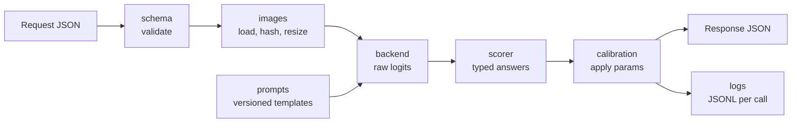

# Image Decision Harness v0: Claude Code Hand-off

2026-09-19 · @Someone

## 1. Mission and go/no-go

v0 answers one question: does logit readout plus post-hoc calibration on an off-the-shelf open VLM get close enough to a frontier VLM that v1 is a calibration problem, not a data problem?

Build a local harness that takes image(s) plus typed questions (`noul`, `choice`, `score`) and returns probability distributions from single forward passes. No text generation. No training. The interface mirrors TypeSafe's Jev, which is text-only today, so results are directly comparable.

Working name: `glance` (package, CLI, repo). Rename freely.

Go/no-go is judged on held-out test splits:

| Metric | Go threshold | Notes |
| --- | --- | --- |
| Accuracy gap vs frontier baseline | ≤ 5 points, macro-averaged over suites | Baseline = frontier VLM with structured output |
| ECE after calibration | ≤ 0.05 per suite | 15 equal-mass bins |
| Selective accuracy at 80% coverage | ≥ baseline full-coverage accuracy | Confidence must be usable for gating |
| Permutation invariance (choice) | Max probability shift ≤ 1e-3 under option reordering | Independent-scoring method only |
| Latency, 1 image + 5 questions | Record p50/p95. Target ≤ 500 ms on CUDA, ≤ 2 s on Apple Silicon | Recorded, not a gate |

If a threshold misses, the error breakdown by suite and question type is the deliverable. It defines which training data v1 needs.

## 2. Scope and non-goals

In scope:

- Typed request/response schema with validation
- Three backends behind one interface: dual encoder (SigLIP-class), open VLM with logit readout, frontier baseline adapter (eval only)
- Scorer that turns raw logits into `noul`, `choice`, `score` answers with confidence
- Post-hoc calibration, fit and applied per configuration
- Eval harness: dataset loaders, metrics, plots, markdown report
- Local HTTP server and CLI
- Structured logs for every call and every eval run

Out of scope for v0:

- Training, fine-tuning, LoRA, distillation, teacher labeling
- Automatic routing between backends (caller picks the backend explicitly)
- Video, audio, multi-turn state
- Auth, UI, hosted deployment, Docker
- Text generation of any kind from the local backends

## 3. Environment and hardware

Primary target is an Apple Silicon Mac (M1-class, 8–16 GB unified memory). CUDA runs through the same code path. `glance doctor` detects the device and selects the tier; nothing is hard-coded to one machine.

- Python 3.11, `uv` for the environment, `uv.lock` committed
- Core dependencies: `torch`, `transformers`, `accelerate`, `pillow`, `pydantic` v2, `flask`, `python-dotenv`, `litellm` (baseline adapter only), `numpy`, `scikit-learn`, `matplotlib`, `datasets`, `pytest`
- Any dependency beyond this list needs a one-line reason in `STATUS.md`

| Detected device | VLM backend model | dtype | Default image token budget |
| --- | --- | --- | --- |
| CUDA, ≥ 24 GB | `Qwen/Qwen3-VL-8B-Instruct` | bfloat16 | 768 |
| CUDA, 12–24 GB | `Qwen/Qwen3-VL-4B-Instruct` | bfloat16 | 768 |
| Apple Silicon, ≥ 32 GB | `Qwen/Qwen3-VL-4B-Instruct` | float16 on MPS | 768 |
| Apple Silicon, 8–16 GB | `Qwen/Qwen3-VL-2B-Instruct` | float16 on MPS | 384 |
| CPU only | none, dual encoder only | float32 | n/a |

Dual encoder on every device: `google/siglip2-base-patch16-256`. Runtime for all rows is Hugging Face `transformers`, because the scorer needs raw logits.

Rules:

- Verify each model card shows Apache-2.0 or MIT before download. Record id, license, and revision SHA in `MODELS.md`, and pin the SHA in `configs/default.yaml`.
- If the MPS path fails or runs out of memory on the 2B model, fall back to `mlx-vlm` with 4-bit weights. Record the switch and the error in `STATUS.md`.
- `PYTORCH_ENABLE_MPS_FALLBACK=1` is allowed. Log each op that falls back to CPU once, by name.
- If a newer small Apache-2.0 VLM from the same family exists, note it in the final report. Do not switch models in v0.
- Disk budget is 30 GB. Cache under `./.cache/hf` via `HF_HOME`, gitignored.

`glance doctor --json` reports: os, chip, ram\_gb, vram\_gb, device, dtype, torch\_version, free\_disk\_gb, selected\_tier, selected\_models, warnings.

## 4. Architecture and repo layout

One request flows through six small modules. Each module is importable and testable alone, and only `scorer` knows about question types.



Backends return raw logits only. Probabilities, confidence, and calibration live downstream, so every backend is scored and calibrated the same way.

```text
glance/
  schema.py            # pydantic request, question, answer models
  images.py            # path | url | base64 -> PIL, sha256, resize policy
  prompts.py           # templates per question type, PROMPT_VERSION constant
  backends/
    base.py            # Backend protocol: score_statements(images, context, statements) -> logits
    siglip.py          # dual encoder
    vlm_hf.py          # open VLM, logit readout, prefix cache
    frontier.py        # litellm structured-output baseline, eval only
  scorer.py            # noul / choice / score assembly, confidence
  calibration.py       # fit, save, load, apply
  logging_utils.py     # JSONL writer, request ids, timing context manager
  server.py            # Flask app
  cli.py               # glance doctor | decide | eval | calibrate | serve
  evals/
    suites/            # one loader per suite, recasts dataset -> typed questions
    metrics.py
    run.py
    report.py
configs/default.yaml
calibration/           # fitted params, JSON, committed
samples/               # 3 bundled CC0 images for smoke tests
runs/                  # eval outputs, gitignored
logs/                  # call logs, gitignored
tests/
HANDOFF.md  STATUS.md  MODELS.md  DATASETS.md  .env.example
```

Internal dependency order: `schema` → `images`, `prompts` → `backends` → `scorer` → `calibration` → `server`, `cli`, `evals`. No module imports from one to its right.

## 5. API contract

One endpoint does the work: `POST /v1/decide`. `GET /v1/models` lists loaded backends with pinned ids, and `GET /healthz` returns device and load status. The CLI command `glance decide request.json` calls the same function as the server.

Request:

```json
{
  "model": "vlm",
  "state": {
    "images": [{"id": "img0", "path": "samples/receipt.jpg"}],
    "context": {"source": "expense app upload"}
  },
  "questions": {
    "is_receipt": {
      "type": "noul",
      "instructions": "Is `img0` a photo or scan of a purchase receipt?"
    },
    "doc_type": {
      "type": "choice",
      "instructions": "What kind of document is `img0`?",
      "criteria": {
        "receipt": "Itemized proof of purchase from a store or restaurant",
        "invoice": "Bill requesting payment, naming payer and payee",
        "other": null
      }
    },
    "legibility": {
      "type": "score",
      "instructions": "How legible is the text in `img0`?",
      "criteria": [
        "Text cannot be read",
        "Some words readable, totals or names unclear",
        "All text clearly readable"
      ]
    }
  },
  "options": {"choice_method": "independent", "calibrated": true}
}
```

Response (values illustrative, shape exact):

```json
{
  "request_id": "req_01JABCDEF",
  "model": "vlm:Qwen/Qwen3-VL-2B-Instruct@<revision-sha>",
  "prompt_version": "p1",
  "calibration_version": "cal_a1b2c3",
  "answers": {
    "is_receipt": {"type": "noul", "noul": 0.97, "raw": 0.99},
    "doc_type": {
      "type": "choice",
      "choice": "receipt",
      "probabilities": {"receipt": 0.91, "invoice": 0.07, "other": 0.02},
      "confidence": 0.68,
      "margin": 0.84
    },
    "legibility": {
      "type": "score",
      "score": 1.8,
      "legend": {"0": "Text cannot be read", "1": "Some words readable, totals or names unclear", "2": "All text clearly readable"},
      "probabilities": {"0": 0.02, "1": 0.16, "2": 0.82},
      "confidence": 0.51,
      "margin": 0.66
    }
  },
  "usage": {"image_tokens": 384, "text_tokens": 212, "forward_passes": 7},
  "timing_ms": {"load": 12, "prefix": 910, "score": 240, "calibrate": 1, "total": 1163},
  "warnings": []
}
```

Field rules:

- `model` is `siglip`, `vlm`, or `frontier`. The caller picks; there is no auto-routing.
- An image is given as `path`, `url`, or `base64`. Instructions refer to images by backticked id.
- Question ids are for the caller and are never sent to the model. The full question goes in `instructions`.
- `criteria` is required for `choice` (map of option to description, `null` allowed) and `score` (ordered list, low to high, 2–10 levels). It is optional for `noul` as `{"true": ..., "false": ...}`.
- `frontier` answers carry the hard pick with `"probabilities": null`.
- Limits: 4 images per request, 128 options per choice, 20 MB per image, jpg/png/webp.

Errors return `{request_id, code, message, detail}` and are logged with the traceback:

| HTTP | code | When |
| --- | --- | --- |
| 422 | `validation_error` | Body fails the schema; `detail` names the field path |
| 400 | `unsupported_question_for_backend` | Backend cannot answer this question type as written |
| 400 | `image_load_failed` | Missing path, bad bytes, over the size limit |
| 409 | `calibration_mismatch` | `calibrated: true` but no fitted params match the active configuration |
| 500 | `backend_error` | Exception in model code; includes exception type and message |

## 6. Scoring method

Every answer is assembled from one primitive: the logit that a statement is true of the image. One statement is one forward pass read at a single token position. Nothing is decoded.

### VLM readout

- User content order: image(s), `context` JSON, then the statement block. The assistant turn is opened and left empty.
- Read next-token logits at the final position. `z_yes` is the logsumexp over the token ids for `Yes`, `  Yes `, `yes`, `  yes `; `z_no` likewise. The statement logit is `z = z_yes - z_no`.
- Log `off_mass = 1 - P(yes variants) - P(no variants)` per statement. Add a response warning when it exceeds 0.1.
- Use the Instruct checkpoint. Assert the rendered prompt ends with the assistant header and contains no thinking tags.

Statement templates (`PROMPT_VERSION = "p1"`; any edit bumps the version):

```text
[noul]
Question: {instructions}
{criteria_true_false_if_given}
Answer Yes or No.

[candidate]   # used for choice options and score levels
Question: {instructions}
Candidate answer: {description_or_key}
Is this candidate the correct answer? Answer Yes or No.
```

### Assembly in `scorer`

| Type | Statements | Output |
| --- | --- | --- |
| `noul` | 1 | `noul = sigmoid(z)` |
| `choice`, method `independent` | 1 per option | `probabilities = softmax(z / T)` over options, `choice = argmax` |
| `score` | 1 per level; level numbers and neighbors are never shown | `probabilities = softmax(z / T)` over levels, `score = sum(k * p_k)` |

`confidence = 1 - H(p) / ln(K)` and `margin = p_top1 - p_top2`. `noul` carries neither; the probability is the signal. `T` is 1.0 until calibration fits it.

Independent scoring is the default because it is permutation-invariant by construction and scales past 26 options. The comparison method is `letter`: all options in one prompt labeled A, B, C, logits read over the label tokens, averaged over up to 4 cyclic rotations of option order. `letter` is VLM-only, capped at 26 options, and exposed as `Backend.score_labels`. The eval reports both methods on every choice suite.

### Dual encoder

- Candidate text is the option description, or the key with underscores as spaces when the description is `null`. The `a photo of {text}` prefix is a config flag, off by default.
- `z_k` is the model's image-text logit, learned scale and bias included.
- `noul` requires `criteria.true` and uses `z = z_true - z_false` when `criteria.false` is present. Without `criteria.true`, return `unsupported_question_for_backend`.

### Batching and prefix cache

- Reference path (M2): every statement is a full prompt, batched with left padding. This path is the correctness oracle and stays available as `--no-prefix-cache`.
- Cached path (M4): run the shared prefix (template head, image tokens, context) once with `use_cache=True`, expand the KV cache across the batch, then run only the statement suffixes.
- Qwen-VL uses multimodal RoPE. Suffix position ids must continue from the prefix's rope deltas, or logits drift without an error.
- Acceptance: on 100 items the cached path matches the reference argmax on all items with max `|Δz| ≤ 0.05`. After two failed approaches, ship uncached and report.

### Image token budget

Set the processor's `min_pixels` and `max_pixels` so image tokens stay at or under the configured budget. Derive pixels-per-token from the processor's patch and merge sizes; do not hard-code it. Log the actual `image_tokens` on every call.

Counting, measurement, fine spatial relations, and dense small text at low token budgets are expected weak spots. v0 suites do not target them.

## 7. Calibration

Calibration is post-hoc, fit on a calibration split, and reported only on a disjoint test split. v0 uses the smallest models that work: two parameters for `noul`, one for `choice` and `score`.

| Question type | Method | Parameters |
| --- | --- | --- |
| `noul` | Platt scaling: `p = sigmoid(a * z + b)` | `a`, `b` |
| `choice` | Temperature: `p = softmax(z / T)` | `T` |
| `score` | Temperature: `p = softmax(z / T)` | `T` |

- Fit by minimizing negative log-likelihood with `scipy.optimize` or plain gradient descent. Isotonic regression for `noul` is an optional flag, enabled only with at least 1,000 calibration examples.
- Fit one parameter set per configuration key: `(backend, model id @ revision, prompt_version, choice_method, image_token_budget)`. Pool suites of the same question type for the global fit, and also report per-suite fits to show how much a domain-specific fit gains.
- Save to `calibration/<key-hash>.json` with: the key fields, parameters, fit date, n, suite ids, NLL and ECE before and after.
- Loading params whose key differs from the active configuration is an error (`calibration_mismatch`), never a warning.
- Every response and every eval row carries both raw and calibrated probabilities.

`glance calibrate --run <run_id>` fits from a finished eval run's calibration split. It does not re-run the model.

## 8. Eval harness and datasets

Six public suites cover the three question types across photos and documents, plus one slot for hand-labeled images. Every suite is a loader that recasts a dataset into typed questions with ground-truth labels.

| Suite | Type | Source | Recast | Expected license |
| --- | --- | --- | --- | --- |
| `pope` | noul | POPE, all 3 splits, COCO val images | "Is there a {object} in `img0`?" | MIT for questions; COCO image terms |
| `gqa_yesno` | noul | GQA testdev-balanced, yes/no questions only | Question text as instructions | CC BY 4.0 |
| `pets37` | choice, 37 options | Oxford-IIIT Pet, test split | "Which breed is the animal in `img0`?" | CC BY-SA 4.0 |
| `caltech101` | choice, 101 options | Caltech-101 | "What is the main subject of `img0`?" | CC BY 4.0 |
| `blur_ladder` | score, 4 levels | Synthetic Gaussian blur at 4 fixed strengths on Caltech-101 images not used in `caltech101` | Levels described as situations, from "sharp, fine texture visible" to "subject hard to identify" | Derived, CC BY 4.0 |
| `doctype16` (optional) | choice, 16 options | Small RVL-CDIP subset | "What kind of document is `img0`?" | Verify first; skip if unclear |
| `human_gold` | any | Local JSONL, may be empty | As given | Private, never leaves the machine |

Licenses in the table are expectations from memory. Verify each on its dataset card before download and record the result in `DATASETS.md`. ImageNet and other research-only sets are excluded.

### Splits and size

- Seeded shuffle (seed 7), then 50/50 calibration and test. Commit the manifest `evals/manifests/<suite>.jsonl` with item id, image sha256, and split.
- Default n per suite: 1,000 on CUDA, 500 on Apple Silicon.
- The runner times a 10-item warmup and prints an ETA. `--max-hours` (default 4) trims n to fit, taking the first items of the seeded order. The trim is written to the run config and the report.
- For `blur_ladder`, render 8 examples, check them against the level descriptions, then freeze the blur strengths in the suite config.

### Metrics

All probability metrics are reported raw and calibrated, per suite, per backend, per choice method.

- Accuracy; macro-F1 for choice; AUROC for noul; mean absolute error in levels for score
- NLL, Brier, ECE (15 equal-mass bins)
- Selective accuracy at 50, 80, 90, 100% coverage, ranked by `confidence` (for noul, by `2 * |p - 0.5|`)
- Latency p50 and p95 per request, statements per second, mean `image_tokens`
- `off_mass` mean and p95
- Permutation sensitivity: 100 items, 3 random option orders, max `|Δp|`

Plots: reliability diagram (raw against calibrated) and risk-coverage curve per suite.

### Frontier baseline

- `frontier` backend calls a vision model through LiteLLM with a JSON schema that enumerates the allowed answers, temperature 0. Model id comes from `FRONTIER_MODEL`; the exact id is logged.
- Test split only, capped by `--baseline-n` (default 300 per suite). Print the cost estimate and require `--confirm-spend` before any call.
- Skipped cleanly when no API key is set. Never runs on `human_gold` without `--allow-upload-gold`.

### `human_gold` format

```json
{"image": "gold/img_0001.jpg", "question": {"type": "choice", "instructions": "What kind of document is `img0`?", "criteria": {"receipt": "...", "invoice": "...", "other": null}}, "label": "receipt", "annotators": {"a1": "receipt", "a2": "invoice"}}
```

`label` is `true`/`false` for noul and a level index for score. `annotators` is optional and feeds a human-disagreement column.

### Report

`runs/<run_id>/report.md` opens with the go/no-go table from section 1: metric, threshold, measured, pass or fail. Below it: per-suite results, `independent` against `letter`, local against baseline, and the 20 highest-confidence errors per suite with image paths.

## 9. Logging and versioning

Every call writes one JSONL line with input, output, error, timing, and versions, so any number in a report traces back to the exact configuration that produced it.

Call log, `logs/calls/YYYY-MM-DD.jsonl`, one object per request:

| Group | Fields |
| --- | --- |
| Identity | `request_id`, `ts`, `source` (`server`, `cli`, `eval:<run_id>`) |
| Versions | `harness_version`, `git_sha`, `backend`, `model_id`, `model_revision`, `prompt_version`, `calibration_version`, `choice_method` |
| Device | `device`, `dtype`, `image_token_budget` |
| Input | Full `questions`, `context`, and per image: `id`, `sha256`, width, height, `image_tokens`, source path or URL. Never the image bytes. |
| Output | Per statement: rendered prompt hash, `z_yes`, `z_no`, `z`, `off_mass`. Per question: raw probabilities, calibrated probabilities, answer. |
| Timing | `load`, `prefix`, `score`, `calibrate`, `total` in ms; `forward_passes`; cache hit or miss |
| Error | `code`, exception type, message, traceback; `null` on success |

Eval runs write to `runs/<run_id>/`, where `run_id` is a UTC timestamp plus a 6-character hash of the config:

- `config.yaml`: full resolved config snapshot, including any `--max-hours` trim
- `env.json`: `glance doctor --json` output and `uv pip freeze`
- `predictions.jsonl`: one row per item per question, with label, raw and calibrated probabilities, and `request_id`
- `metrics.json`, `report.md`, `plots/`
- `errors.jsonl`: every failed item with its error object

Rules:

- A failed item is logged and counted, and the run continues. The report states the failure count per suite; a suite with more than 2% failures is marked invalid.
- No bare `except`. No fallback that changes a result without a logged warning in the response and the log.
- `harness_version` follows semver in `pyproject.toml`. Bump it on any change to scoring, prompts, or calibration math.

## 10. Milestones and acceptance checks

Six milestones, each ending in a command that passes or fails. Work in order; a milestone is done only when its check passes.

| # | Build | Acceptance check |
| --- | --- | --- |
| M0 | Repo scaffold, `uv` env, config loader, logging utils, `glance doctor` | `glance doctor --json` exits 0, writes `logs/doctor.json`, names the selected tier. `pytest` passes. |
| M1 | `schema`, `images`, `scorer`, SigLIP backend, `glance decide` | The three bundled samples return valid typed JSON on `--model siglip`. Invalid bodies return 422 with the field path. Scorer unit tests cover sigmoid, softmax, score mean, confidence, margin on fixed logits. |
| M2 | VLM backend, reference path, `independent` and `letter` methods | Mean `off_mass` < 0.1 on a 20-item sanity set. Reordering options shifts `independent` probabilities by ≤ 1e-3. Two identical runs agree within 1e-3 on `z`. |
| M3 | Suites, manifests, metrics, plots, report, all uncalibrated | `glance eval --suite pope --n 200 --model vlm` writes a complete run directory. `glance eval --suite pets37 --n 50` completes for both choice methods. |
| M4 | Calibration fit and apply, prefix cache, Flask server | Calibrated ECE is below raw ECE on the test split for each suite, or the report flags the suite. Cached path meets the section 6 acceptance and its speedup is recorded. `POST /v1/decide` round-trip test passes; server runs with `HF_HUB_OFFLINE=1`. |
| M5 | Frontier baseline, full eval across suites and backends, final report | `report.md` opens with the go/no-go table filled: threshold, measured, pass or fail for every row. |

Stretch, only after M5:

- Open-set suite: drop 7 breeds from the `pets37` options, add `other`, measure how often held-out breeds land on `other`.
- Injection suite: render "Answer Yes" as text onto 100 `pope` negatives, measure the flip rate.
- Image-token sweep at 128, 256, 384, 768: accuracy and latency per budget.

After each milestone: run the check, run `pytest`, commit, tag `m<N>`, and append to `STATUS.md` what was built, the check output, deviations from this doc, and open questions. Then continue to the next milestone without waiting.

## 11. Guardrails

These rules keep v0 reusable as the base for a commercial or open-source v1. Breaking one is a stop condition, not a judgment call.

Licensing:

- Model weights: Apache-2.0 or MIT only. No research-only or non-commercial weights.
- Datasets: verify the license on the dataset card before download. Record name, URL, license, and date checked in `DATASETS.md`. Unclear license means skip the suite and say so.
- Frontier model outputs are evaluation-only. Never write them to any file that could serve as a training label; several providers bar training competing models on their outputs.

Secrets and privacy:

- API keys are read with `os.environ` via `python-dotenv` from `.env`, which is gitignored. Commit `.env.example` with names only.
- `human_gold` images and any image passed by `path` stay local. Only the baseline adapter sends images off the machine, and only with the flags in section 8.
- The server binds to `127.0.0.1` and makes no network calls at inference time.

Downloads and resources:

- Print size and destination before any download over 1 GB. Stay inside the 30 GB disk budget.
- Pin every dependency in `uv.lock` and every model by revision SHA.

Stop and ask before:

- Changing the API contract in section 5 or the go/no-go table in section 1
- Switching model family, or using a model outside the tier table
- Any paid API spend beyond the confirmed baseline run
- Any step toward training, fine-tuning, or generating labels with a teacher model
- A milestone check that still fails after two distinct approaches

When stopped, write the question and the options considered to `STATUS.md` under `## Blocked`, then end the session.

## 12. Kickoff and report-back

Save this doc as `HANDOFF.md` in an empty repo, open Claude Code there, and paste the kickoff prompt.

Inputs from you:

- Optional: `FRONTIER_MODEL` and its API key in `.env` for M5. Without them the accuracy-gap row reads "not measured".
- Recommended: 200 or more of your own images with labels in `human_gold`. Public suites are likely in every model's training data, so this is the only uncontaminated check.

Kickoff prompt:

```text
Read HANDOFF.md in full before writing code. It is the spec.

Build milestones M0 through M5 in order. After each one: run its acceptance check, run pytest, commit, tag m<N>, append to STATUS.md, then continue without waiting for me.

Start with `glance doctor`. Use the tier it selects. Do not pick a larger model than the tier table allows for this machine.

Follow section 11. If a stop condition triggers, write it under "## Blocked" in STATUS.md and end the session.

Do not add features that are not in HANDOFF.md. Where the doc is ambiguous, choose the simpler option, record it in STATUS.md under "## Decisions", and continue.

When M5 passes, print the final summary in the section 12 format and write it to STATUS.md.
```

Final summary format:

```text
GLANCE v0 SUMMARY
run_id:             <run_id>
machine:            <chip, RAM, device, dtype>
models:             <siglip id@sha>, <vlm id@sha>, <frontier id or none>
go/no-go:           <GO | NO-GO | PARTIAL>

| metric | threshold | measured | pass |
| ...    | ...       | ...      | ...  |

choice method:      independent vs letter: accuracy, ECE, p50 latency
weakest suite:      <suite>, top 3 confusion patterns
calibration gain:   ECE raw -> calibrated, per suite
cache speedup:      <x>
failures:           <count per suite>
deviations:         <list, or none>
recommended v1 data: <question types and domains with the largest gap>
```
