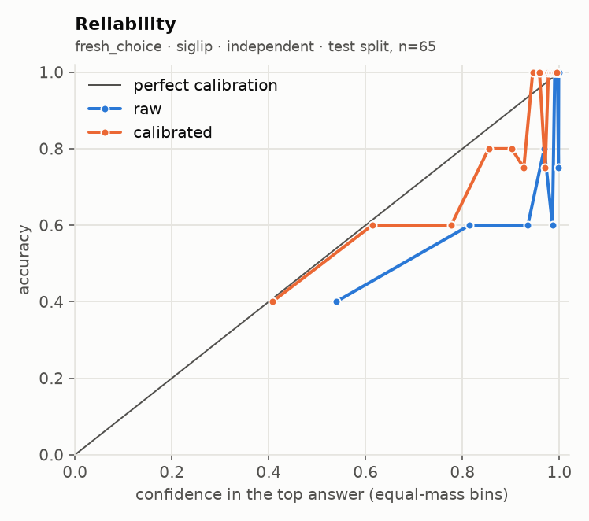
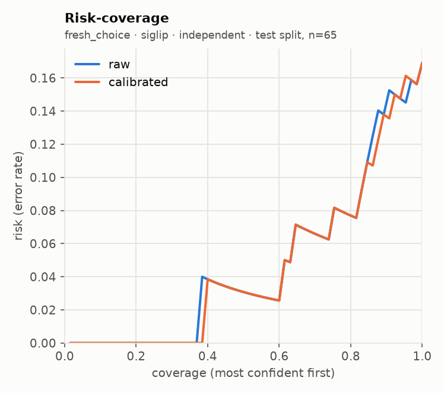
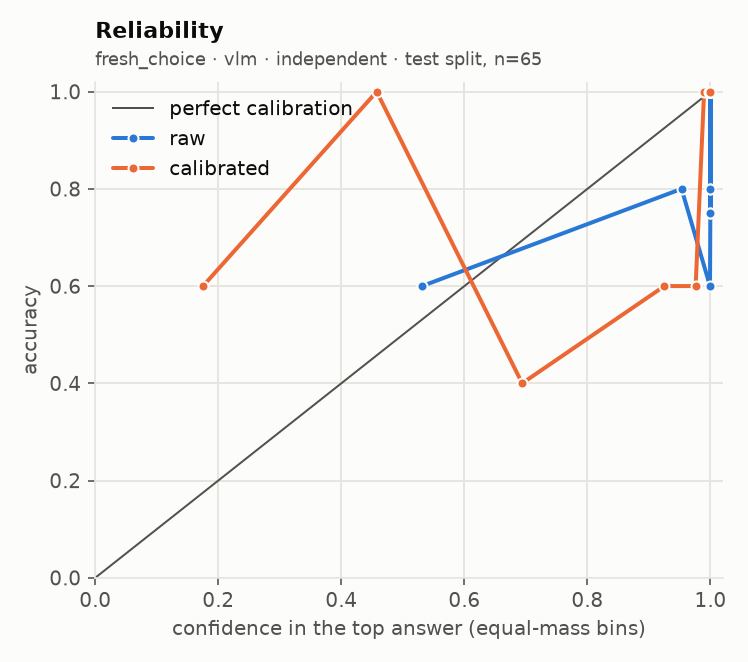
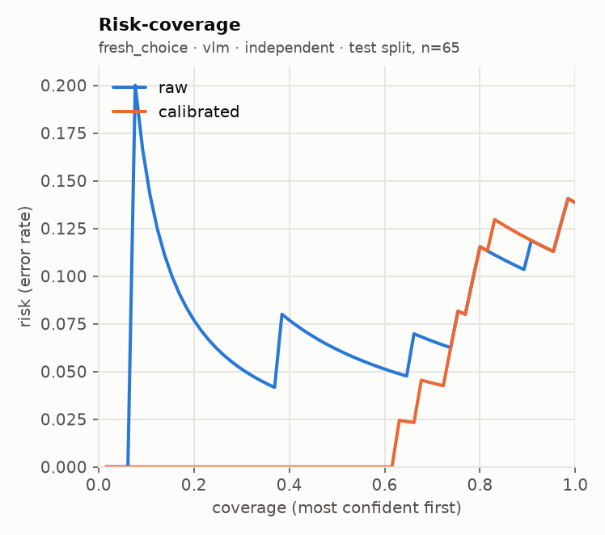
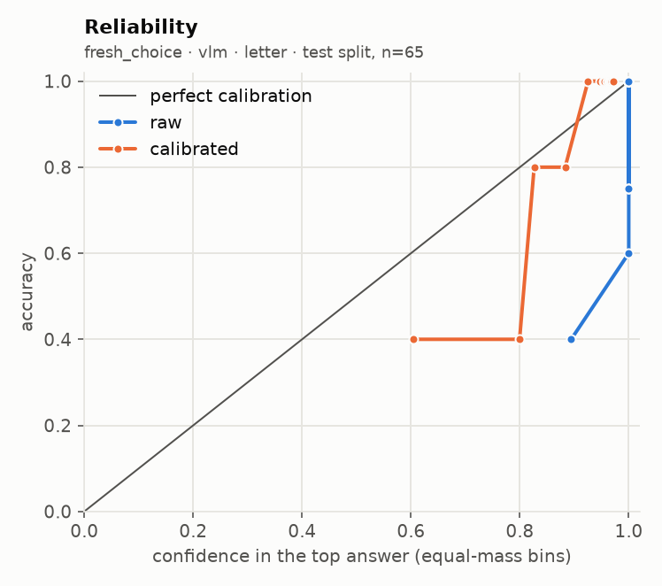
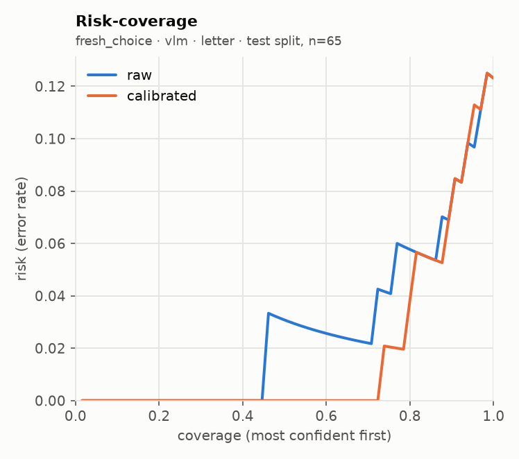
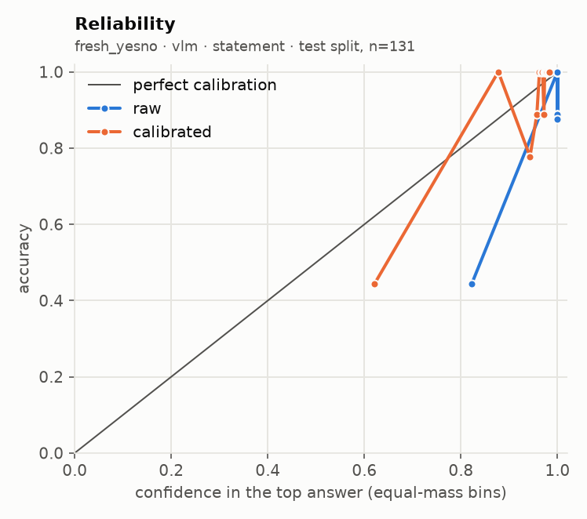
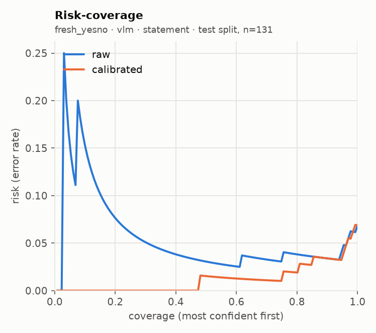

# glance eval report · run `20260920T205633Z-99f822`

**Go/no-go: NO-GO** (judged on held-out test splits; primary local backend: `vlm`)

| Metric | Threshold | Measured | Pass |
| --- | --- | --- | --- |
| Accuracy gap vs frontier baseline | <= 5 points, macro-averaged over suites | not measured (no frontier baseline run) | not measured |
| ECE after calibration | <= 0.05 per suite (15 equal-mass bins) | worst 0.152 (fresh_choice, sampling floor 0.049); over threshold: fresh_choice, fresh_yesno | FAIL |
| Selective accuracy at 80% coverage | >= baseline full-coverage accuracy | 0.933 local (macro); baseline not measured | not measured |
| Permutation invariance (choice) | max probability shift <= 1e-3 (independent) | not measured | not measured |
| Latency, 1 image + 5 questions | recorded; target <= 2000 ms (not a gate) | not measured | recorded |

## Run

- Machine: Apple M5, 32.0 GB RAM, device `mps`, tier `apple_32gb`
- `vlm`: `Qwen/Qwen3-VL-4B-Instruct@ebb281ec70b05090aa6165b016eac8ec08e71b17` (float16, image token budget 768)
- `siglip`: `google/siglip2-base-patch16-256@3f9f96cb90da5dbc758b01813f2f6f1aee24c1ab` (float32, image token budget None)
- Harness 0.2.1 at git `021571050f`, prompts `p1`, prefix cache on
- Prefix cache check: 3.75x on 100 items (1685 statements); argmax agreement 100/100, max |dz| 0.075 vs limit 0.05 -> acceptance NOT met, shipped uncached
- n per suite: requested 300; used fresh_choice 300, fresh_yesno 300; seed 7, calibration/test alternate down the seeded order
- Note: `fresh_yesno` does not run on `siglip` (its questions carry no criteria the backend can use)

## Per-suite results (test split)

| Suite | Backend | Method | n | Acc | AUROC / F1 / MAE | NLL raw→cal | Brier raw→cal | ECE raw→cal | ECE floor at this n | Sel acc 50/80/90/100 (cal) | Failures | Valid |
| --- | --- | --- | --- | --- | --- | --- | --- | --- | --- | --- | --- | --- |
| fresh_choice | siglip | independent | 65 | 0.831 | 0.815 | 0.761 → 0.620 | 0.276 → 0.256 | 0.112 → 0.063 | 0.084 | 0.969 / 0.923 / 0.862 / 0.831 | 0/131 | yes |
| fresh_choice | vlm | independent | 65 | 0.862 | 0.857 | 1.933 → 0.635 | 0.240 → 0.263 | 0.109 → 0.152 | 0.049 | 1.000 / 0.885 / 0.879 / 0.862 | 0/131 | yes |
| fresh_choice | vlm | letter | 65 | 0.877 | 0.869 | 2.303 → 0.469 | 0.239 → 0.196 | 0.115 → 0.084 | 0.088 | 1.000 / 0.962 / 0.931 / 0.877 | 0/131 | yes |
| fresh_yesno | vlm | statement | 131 | 0.931 | 0.963 | 0.961 → 0.181 | 0.060 → 0.049 | 0.057 → 0.060 | 0.053 | 0.985 / 0.981 / 0.966 / 0.931 | 0/262 | yes |

AUROC for noul, macro-F1 for choice, mean absolute error in levels (expected score vs label) for score. Selective accuracy ranks by `confidence` (noul: `2·|p − 0.5|`). A suite with more than 2% failed items is invalid. `ECE floor at this n` is the ECE a perfectly calibrated predictor with the same confidences would measure on this many items (200 simulated draws): equal-mass ECE is biased upward on small samples, so read each ECE against its floor.

**Flagged: calibrated ECE is not below raw ECE on the test split for:** `fresh_choice` (vlm, independent: 0.109 → 0.152), `fresh_yesno` (vlm, statement: 0.057 → 0.060)

## Error breakdown (what v1 data this points to)

| Suite | Type | Test n | Error rate | ECE (best available) | Over ECE threshold | Gap to baseline (points) | Top confusions |
| --- | --- | --- | --- | --- | --- | --- | --- |
| fresh_choice | choice | 65 | 13.8% | 0.152 | yes | - | car → church (2); bird → mountain (2); car → bridge (1) |
| fresh_yesno | noul | 131 | 6.9% | 0.060 | yes | - | yes → no (5); no → yes (4) |

Primary backend `vlm`, `independent` for choice. Recommended v1 data: by error rate: fresh_choice (choice) 13.8%, fresh_yesno (noul) 6.9%; calibrated ECE still over 0.05: fresh_choice 0.152, fresh_yesno 0.060; gap to a frontier baseline not measured.

## Calibration

| Version | Backend | Choice method | Type | Fit | Params | n (cal split) | Suites pooled | NLL before→after | ECE before→after |
| --- | --- | --- | --- | --- | --- | --- | --- | --- | --- |
| cal_8edfd9 | siglip | independent | choice | temperature | {'T': 1.5097} | 66 | fresh_choice | 0.640 → 0.554 | 0.060 → 0.070 |
| cal_1d9418 | vlm | independent | noul | platt | {'a': 0.1807, 'b': 0.3003} | 131 | fresh_yesno | 0.739 → 0.196 | 0.066 → 0.047 |
| cal_1d9418 | vlm | independent | choice | temperature | {'T': 3.6553} | 66 | fresh_choice | 0.991 → 0.484 | 0.087 → 0.085 |
| cal_eac746 | vlm | letter | noul | platt | {'a': 0.1807, 'b': 0.3003} | 131 | fresh_yesno | 0.739 → 0.196 | 0.066 → 0.047 |
| cal_eac746 | vlm | letter | choice | temperature | {'T': 4.7785} | 66 | fresh_choice | 1.826 → 0.488 | 0.106 → 0.097 |

Pooled fit (what the API applies) against a per-suite fit, on the test split:

| Suite | Backend | Method | ECE raw | ECE pooled fit | ECE per-suite fit | NLL pooled | NLL per-suite |
| --- | --- | --- | --- | --- | --- | --- | --- |
| fresh_choice | siglip | independent | 0.112 | 0.063 | 0.063 | 0.620 | 0.620 |
| fresh_choice | vlm | independent | 0.109 | 0.152 | 0.152 | 0.635 | 0.635 |
| fresh_choice | vlm | letter | 0.115 | 0.084 | 0.084 | 0.469 | 0.469 |
| fresh_yesno | vlm | statement | 0.057 | 0.060 | 0.060 | 0.181 | 0.181 |

## `independent` against `letter`

| Suite | Backend | n | Options seen by letter | Acc letter | Acc independent (same options) | Acc independent (all options) | ECE letter raw→cal | ECE independent raw→cal | p50 ms letter / independent |
| --- | --- | --- | --- | --- | --- | --- | --- | --- | --- |
| fresh_choice | vlm | 65 | 13 of 13 | 0.877 | 0.862 | 0.862 | 0.115 → 0.084 | 0.109 → 0.152 | 2320 / 2499 |

`letter` is capped at 26 options. On larger suites it sees the true label plus 25 seeded random distractors; `independent (same options)` restricts the independent logits to that same subset, so the two columns are comparable.

## Local against the frontier baseline

The frontier baseline did not run, so the accuracy-gap and selective-accuracy rows read "not measured". Set `FRONTIER_MODEL` and its API key in `.env`, then run `glance eval --model frontier --confirm-spend` (or the full eval again with `--confirm-spend`).

## Latency and throughput

| Suite | Backend | Method | p50 ms / request | p95 ms / request | Statements / s | Mean image tokens | off_mass mean | off_mass p95 |
| --- | --- | --- | --- | --- | --- | --- | --- | --- |
| fresh_choice | siglip | independent | 48 | 107 | 204.8 | 256 | - | - |
| fresh_choice | vlm | independent | 2498 | 2686 | 5.2 | 742 | 0.00000 | 0.00000 |
| fresh_choice | vlm | letter | 2320 | 3172 | 1.7 | 742 | 0.00003 | 0.00000 |
| fresh_yesno | vlm | statement | 1764 | 2131 | 0.6 | 742 | 0.00000 | 0.00000 |

## Plots

**fresh_choice · siglip · independent**

 

**fresh_choice · vlm · independent**

 

**fresh_choice · vlm · letter**

 

**fresh_yesno · vlm · statement**

 

## Highest-confidence errors (up to 20 per suite)

### fresh_choice · vlm · independent

Most common confusions: car → church (2); bird → mountain (2); car → bridge (1)

| Item | True | Predicted | Confidence | Top probability | Image |
| --- | --- | --- | --- | --- | --- |
| bird_1f941b23 | bird | mountain | 0.957 | 0.985 | `.cache/eval_images/fresh_choice/bird_1f941b23.jpg` |
| car_cae03a13 | car | mountain | 0.936 | 0.977 | `.cache/eval_images/fresh_choice/car_cae03a13.jpg` |
| bird_086777f1 | bird | mountain | 0.844 | 0.930 | `.cache/eval_images/fresh_choice/bird_086777f1.jpg` |
| car_c8c8d773 | car | bridge | 0.817 | 0.921 | `.cache/eval_images/fresh_choice/car_c8c8d773.jpg` |
| church_12849fb8 | church | car | 0.642 | 0.622 | `.cache/eval_images/fresh_choice/church_12849fb8.jpg` |
| horse_63c57f91 | horse | church | 0.601 | 0.793 | `.cache/eval_images/fresh_choice/horse_63c57f91.jpg` |
| mountain_8d9e77b6 | mountain | church | 0.495 | 0.710 | `.cache/eval_images/fresh_choice/mountain_8d9e77b6.jpg` |
| car_bcf7c0f0 | car | church | 0.030 | 0.153 | `.cache/eval_images/fresh_choice/car_bcf7c0f0.jpg` |
| car_06483af2 | car | church | 0.029 | 0.148 | `.cache/eval_images/fresh_choice/car_06483af2.jpg` |

### fresh_yesno · vlm · statement

Most common confusions: yes → no (5); no → yes (4)

| Item | True | Predicted | Confidence | Top probability | Image |
| --- | --- | --- | --- | --- | --- |
| dog_5abeff59__dog | yes | no | 0.945 | 0.972 | `.cache/eval_images/fresh_yesno/dog_5abeff59__dog.jpg` |
| train_114bf7a0__mountain | no | yes | 0.918 | 0.959 | `.cache/eval_images/fresh_yesno/train_114bf7a0__mountain.jpg` |
| bridge_fd860db6__bridge | yes | no | 0.902 | 0.951 | `.cache/eval_images/fresh_yesno/bridge_fd860db6__bridge.jpg` |
| flower_61225879__flower | yes | no | 0.872 | 0.936 | `.cache/eval_images/fresh_yesno/flower_61225879__flower.jpg` |
| beach_3db6bf61__beach | yes | no | 0.324 | 0.662 | `.cache/eval_images/fresh_yesno/beach_3db6bf61__beach.jpg` |
| bridge_1ddb4b4b__bridge | yes | no | 0.277 | 0.639 | `.cache/eval_images/fresh_yesno/bridge_1ddb4b4b__bridge.jpg` |
| dog_9e93ef7c__flower | no | yes | 0.272 | 0.636 | `.cache/eval_images/fresh_yesno/dog_9e93ef7c__flower.jpg` |
| bridge_4b995b67__train | no | yes | 0.165 | 0.582 | `.cache/eval_images/fresh_yesno/bridge_4b995b67__train.jpg` |
| bridge_4aaddbe2__car | no | yes | 0.123 | 0.561 | `.cache/eval_images/fresh_yesno/bridge_4aaddbe2__car.jpg` |

