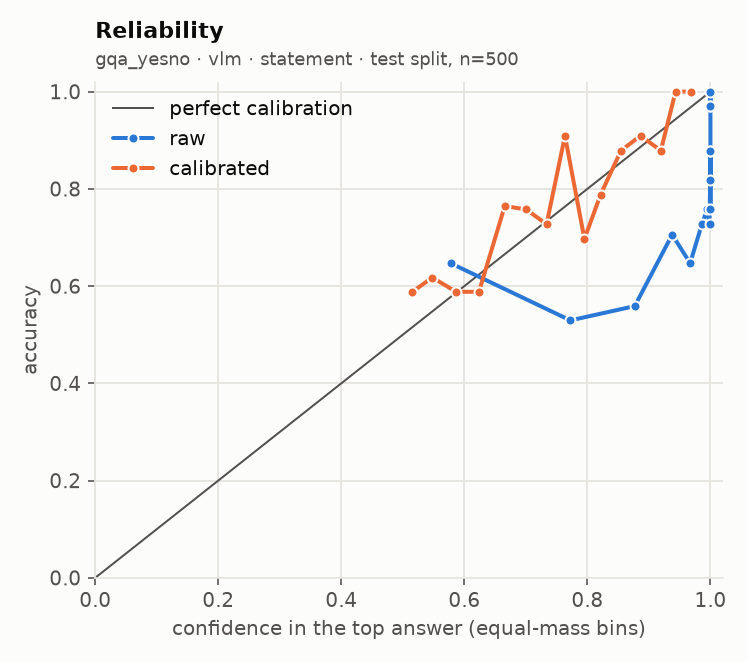
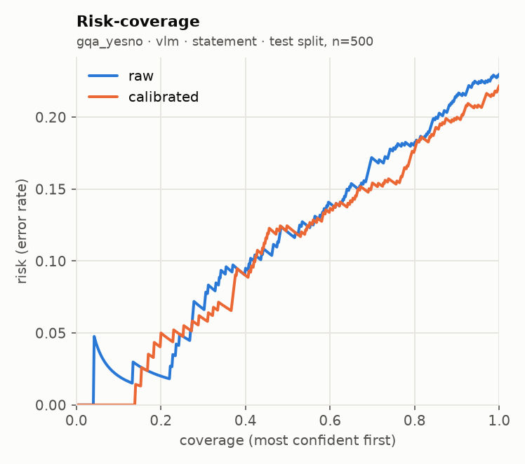
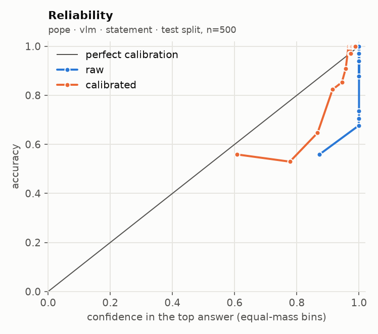
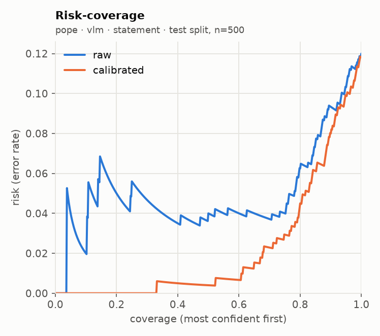

# glance eval report · run `20260920T082750Z-cee6d4`

**Go/no-go: NO-GO** (judged on held-out test splits; primary local backend: `vlm`)

| Metric | Threshold | Measured | Pass |
| --- | --- | --- | --- |
| Accuracy gap vs frontier baseline | <= 5 points, macro-averaged over suites | not measured (no frontier baseline run) | not measured |
| ECE after calibration | <= 0.05 per suite (15 equal-mass bins) | worst 0.061 (pope, sampling floor 0.030); over threshold: gqa_yesno, pope | FAIL |
| Selective accuracy at 80% coverage | >= baseline full-coverage accuracy | 0.889 local (macro); baseline not measured | not measured |
| Permutation invariance (choice) | max probability shift <= 1e-3 (independent) | not measured | not measured |
| Latency, 1 image + 5 questions | recorded; target <= 2000 ms (not a gate) | not measured | recorded |

## Run

- Machine: Apple M5, 32.0 GB RAM, device `mps`, tier `apple_32gb`
- `vlm`: `Qwen/Qwen3-VL-4B-Instruct@ebb281ec70b05090aa6165b016eac8ec08e71b17` (float16, image token budget 768)
- Harness 0.2.1 at git `89c77bc9b6`, prompts `p1`, prefix cache off (reference path)
- Prefix cache check: 3.75x on 100 items (1685 statements); argmax agreement 100/100, max |dz| 0.075 vs limit 0.05 -> acceptance NOT met, shipped uncached
- n per suite: requested 1000; used pope 1000, gqa_yesno 1000; seed 7, calibration/test alternate down the seeded order

## Per-suite results (test split)

| Suite | Backend | Method | n | Acc | AUROC / F1 / MAE | NLL raw→cal | Brier raw→cal | ECE raw→cal | ECE floor at this n | Sel acc 50/80/90/100 (cal) | Failures | Valid |
| --- | --- | --- | --- | --- | --- | --- | --- | --- | --- | --- | --- | --- |
| gqa_yesno | vlm | statement | 500 | 0.770 → 0.778 | 0.853 | 1.148 → 0.476 | 0.201 → 0.157 | 0.179 → 0.053 | 0.055 | 0.876 / 0.823 / 0.800 / 0.778 | 0/1000 | yes |
| pope | vlm | statement | 500 | 0.880 → 0.882 | 0.952 | 1.550 → 0.273 | 0.115 → 0.085 | 0.111 → 0.061 | 0.030 | 0.996 / 0.955 / 0.920 / 0.882 | 0/1000 | yes |

AUROC for noul, macro-F1 for choice, mean absolute error in levels (expected score vs label) for score. Selective accuracy ranks by `confidence` (noul: `2·|p − 0.5|`). A suite with more than 2% failed items is invalid. `ECE floor at this n` is the ECE a perfectly calibrated predictor with the same confidences would measure on this many items (200 simulated draws): equal-mass ECE is biased upward on small samples, so read each ECE against its floor.

## Error breakdown (what v1 data this points to)

| Suite | Type | Test n | Error rate | ECE (best available) | Over ECE threshold | Gap to baseline (points) | Top confusions |
| --- | --- | --- | --- | --- | --- | --- | --- |
| gqa_yesno | noul | 500 | 22.2% | 0.053 | yes | - | no → yes (65); yes → no (46) |
| pope | noul | 500 | 11.8% | 0.061 | yes | - | yes → no (49); no → yes (10) |

Primary backend `vlm`, `independent` for choice. Recommended v1 data: by error rate: gqa_yesno (noul) 22.2%, pope (noul) 11.8%; calibrated ECE still over 0.05: gqa_yesno 0.053, pope 0.061; gap to a frontier baseline not measured.

## Calibration

| Version | Backend | Choice method | Type | Fit | Params | n (cal split) | Suites pooled | NLL before→after | ECE before→after |
| --- | --- | --- | --- | --- | --- | --- | --- | --- | --- |
| cal_1d9418 | vlm | independent | noul | platt | {'a': 0.1765, 'b': 0.4532} | 1000 | gqa_yesno, pope | 1.031 → 0.356 | 0.123 → 0.033 |

Pooled fit (what the API applies) against a per-suite fit, on the test split:

| Suite | Backend | Method | ECE raw | ECE pooled fit | ECE per-suite fit | NLL pooled | NLL per-suite |
| --- | --- | --- | --- | --- | --- | --- | --- |
| gqa_yesno | vlm | statement | 0.179 | 0.053 | 0.065 | 0.476 | 0.477 |
| pope | vlm | statement | 0.111 | 0.061 | 0.056 | 0.273 | 0.247 |

## `independent` against `letter`

No choice suite ran with both methods.

## Local against the frontier baseline

The frontier baseline did not run, so the accuracy-gap and selective-accuracy rows read "not measured". Set `FRONTIER_MODEL` and its API key in `.env`, then run `glance eval --model frontier --confirm-spend` (or the full eval again with `--confirm-spend`).

## Latency and throughput

| Suite | Backend | Method | p50 ms / request | p95 ms / request | Statements / s | Mean image tokens | off_mass mean | off_mass p95 |
| --- | --- | --- | --- | --- | --- | --- | --- | --- |
| gqa_yesno | vlm | statement | 450 | 478 | 2.3 | 269 | 0.00003 | 0.00000 |
| pope | vlm | statement | 456 | 535 | 2.3 | 272 | 0.00000 | 0.00000 |

## Plots

**gqa_yesno · vlm · statement**

 

**pope · vlm · statement**

 

## Highest-confidence errors (up to 20 per suite)

### gqa_yesno · vlm · statement

Most common confusions: no → yes (65); yes → no (46)

| Item | True | Predicted | Confidence | Top probability | Image |
| --- | --- | --- | --- | --- | --- |
| 20456727 | no | yes | 0.864 | 0.932 | `.cache/eval_images/gqa_yesno/20456727.jpg` |
| 201407334 | no | yes | 0.855 | 0.927 | `.cache/eval_images/gqa_yesno/201407334.jpg` |
| 202286714 | yes | no | 0.834 | 0.917 | `.cache/eval_images/gqa_yesno/202286714.jpg` |
| 201795290 | yes | no | 0.818 | 0.909 | `.cache/eval_images/gqa_yesno/201795290.jpg` |
| 20567759 | no | yes | 0.809 | 0.904 | `.cache/eval_images/gqa_yesno/20567759.jpg` |
| 201061298 | no | yes | 0.772 | 0.886 | `.cache/eval_images/gqa_yesno/201061298.jpg` |
| 201879811 | no | yes | 0.745 | 0.872 | `.cache/eval_images/gqa_yesno/201879811.jpg` |
| 201711321 | no | yes | 0.735 | 0.868 | `.cache/eval_images/gqa_yesno/201711321.jpg` |
| 20412256 | no | yes | 0.715 | 0.858 | `.cache/eval_images/gqa_yesno/20412256.jpg` |
| 201047402 | no | yes | 0.696 | 0.848 | `.cache/eval_images/gqa_yesno/201047402.jpg` |
| 20923159 | yes | no | 0.687 | 0.844 | `.cache/eval_images/gqa_yesno/20923159.jpg` |
| 201342325 | yes | no | 0.668 | 0.834 | `.cache/eval_images/gqa_yesno/201342325.jpg` |
| 201951877 | no | yes | 0.638 | 0.819 | `.cache/eval_images/gqa_yesno/201951877.jpg` |
| 201972699 | yes | no | 0.637 | 0.818 | `.cache/eval_images/gqa_yesno/201972699.jpg` |
| 20611590 | yes | no | 0.633 | 0.817 | `.cache/eval_images/gqa_yesno/20611590.jpg` |
| 202100299 | no | yes | 0.633 | 0.817 | `.cache/eval_images/gqa_yesno/202100299.jpg` |
| 201273169 | yes | no | 0.629 | 0.815 | `.cache/eval_images/gqa_yesno/201273169.jpg` |
| 201481607 | yes | no | 0.629 | 0.815 | `.cache/eval_images/gqa_yesno/201481607.jpg` |
| 20306957 | yes | no | 0.606 | 0.803 | `.cache/eval_images/gqa_yesno/20306957.jpg` |
| 201080527 | yes | no | 0.604 | 0.802 | `.cache/eval_images/gqa_yesno/201080527.jpg` |

### pope · vlm · statement

Most common confusions: yes → no (49); no → yes (10)

| Item | True | Predicted | Confidence | Top probability | Image |
| --- | --- | --- | --- | --- | --- |
| random_923 | yes | no | 0.948 | 0.974 | `.cache/eval_images/pope/random_923.jpg` |
| adversarial_989 | yes | no | 0.937 | 0.969 | `.cache/eval_images/pope/adversarial_989.jpg` |
| random_241 | yes | no | 0.921 | 0.961 | `.cache/eval_images/pope/random_241.jpg` |
| popular_1853 | yes | no | 0.918 | 0.959 | `.cache/eval_images/pope/popular_1853.jpg` |
| adversarial_1113 | yes | no | 0.908 | 0.954 | `.cache/eval_images/pope/adversarial_1113.jpg` |
| random_2269 | yes | no | 0.902 | 0.951 | `.cache/eval_images/pope/random_2269.jpg` |
| adversarial_357 | yes | no | 0.898 | 0.949 | `.cache/eval_images/pope/adversarial_357.jpg` |
| popular_179 | yes | no | 0.897 | 0.948 | `.cache/eval_images/pope/popular_179.jpg` |
| adversarial_141 | yes | no | 0.883 | 0.942 | `.cache/eval_images/pope/adversarial_141.jpg` |
| popular_1642 | no | yes | 0.869 | 0.934 | `.cache/eval_images/pope/popular_1642.jpg` |
| random_1271 | yes | no | 0.844 | 0.922 | `.cache/eval_images/pope/random_1271.jpg` |
| random_2693 | yes | no | 0.832 | 0.916 | `.cache/eval_images/pope/random_2693.jpg` |
| random_2955 | yes | no | 0.828 | 0.914 | `.cache/eval_images/pope/random_2955.jpg` |
| popular_779 | yes | no | 0.801 | 0.900 | `.cache/eval_images/pope/popular_779.jpg` |
| random_2417 | yes | no | 0.791 | 0.895 | `.cache/eval_images/pope/random_2417.jpg` |
| random_1859 | yes | no | 0.784 | 0.892 | `.cache/eval_images/pope/random_1859.jpg` |
| adversarial_977 | yes | no | 0.782 | 0.891 | `.cache/eval_images/pope/adversarial_977.jpg` |
| adversarial_1593 | yes | no | 0.782 | 0.891 | `.cache/eval_images/pope/adversarial_1593.jpg` |
| popular_121 | yes | no | 0.774 | 0.887 | `.cache/eval_images/pope/popular_121.jpg` |
| adversarial_2385 | yes | no | 0.772 | 0.886 | `.cache/eval_images/pope/adversarial_2385.jpg` |

