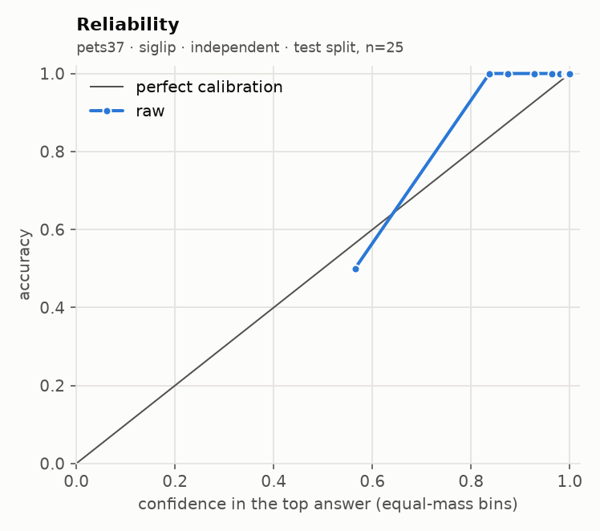
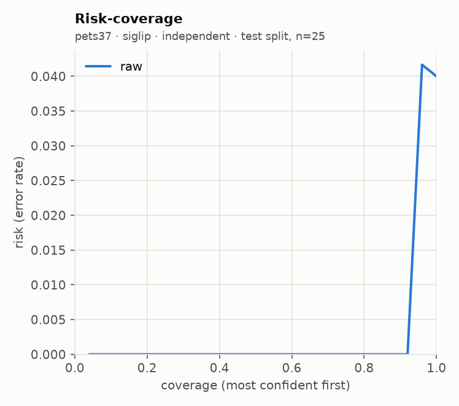
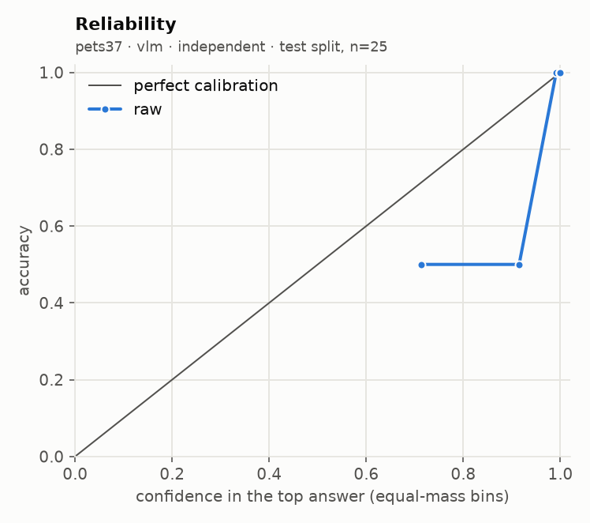
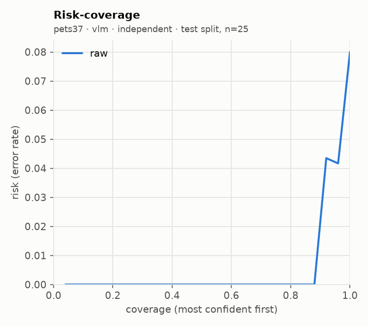
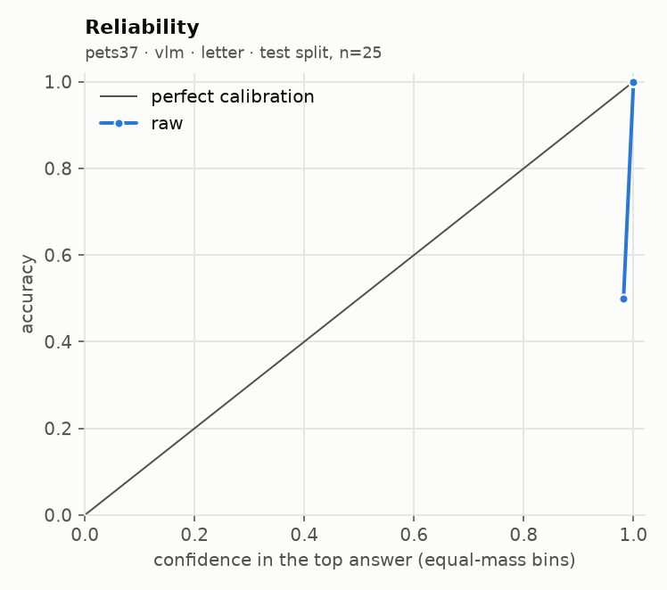
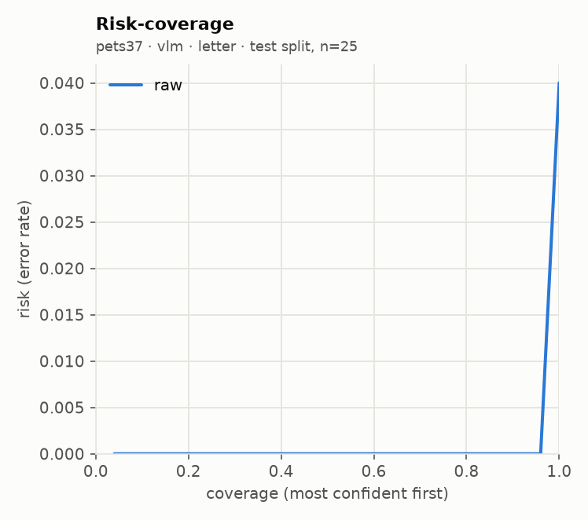

# glance eval report · run `20260919T230914Z-dac969`

**Go/no-go: PARTIAL** (judged on held-out test splits; primary local backend: `vlm`)

| Metric | Threshold | Measured | Pass |
| --- | --- | --- | --- |
| Accuracy gap vs frontier baseline | <= 5 points, macro-averaged over suites | not measured (no frontier baseline run) | not measured |
| ECE after calibration | <= 0.05 per suite (15 equal-mass bins) | not measured (uncalibrated run) | not measured |
| Selective accuracy at 80% coverage | >= baseline full-coverage accuracy | 1.000 local (macro); baseline not measured | not measured |
| Permutation invariance (choice) | max probability shift <= 1e-3 (independent) | 0.0e+00 (pets37) | pass |
| Latency, 1 image + 5 questions | recorded; target <= 2000 ms on mps (not a gate) | p50 8958 ms, p95 11247 ms | recorded |

## Run

- Machine: Apple M5, 32.0 GB RAM, device `mps`, tier `apple_32gb`
- `siglip`: `google/siglip2-base-patch16-256@3f9f96cb90da5dbc758b01813f2f6f1aee24c1ab` (float32, image token budget None)
- `vlm`: `Qwen/Qwen3-VL-4B-Instruct@ebb281ec70b05090aa6165b016eac8ec08e71b17` (float16, image token budget 768)
- Harness 0.1.0 at git `3f116790f2`, prompts `p1`, prefix cache off
- n per suite: requested 50, used 50, seed 7, alternating calibration/test down the seeded order
- Note: frontier baseline not run: FRONTIER_MODEL is not set (accuracy gap reads "not measured")

## Per-suite results (test split)

| Suite | Backend | Method | n | Acc | AUROC / F1 / MAE | NLL raw→cal | Brier raw→cal | ECE raw→cal | Sel acc 50/80/90/100 (cal) | Failures | Valid |
| --- | --- | --- | --- | --- | --- | --- | --- | --- | --- | --- | --- |
| pets37 | siglip | independent | 25 | 0.960 | 0.917 | 0.100 → - | 0.044 → - | 0.041 → - | 1.000 / 1.000 / 1.000 / 0.960 | 0/50 | yes |
| pets37 | vlm | independent | 25 | 0.920 | 0.765 | 0.183 → - | 0.114 → - | 0.051 → - | 1.000 / 1.000 / 1.000 / 0.920 | 0/50 | yes |
| pets37 | vlm | letter | 25 | 0.960 | 0.882 | 0.142 → - | 0.075 → - | 0.039 → - | 1.000 / 1.000 / 1.000 / 0.960 | 0/50 | yes |

AUROC for noul, macro-F1 for choice, mean absolute error in levels (expected score vs label) for score. Selective accuracy ranks by `confidence` (noul: `2·|p − 0.5|`). A suite with more than 2% failed items is invalid.

## Calibration

This run is uncalibrated (no calibration params were fit).

## `independent` against `letter`

| Suite | Backend | n | Options seen by letter | Acc letter | Acc independent (same options) | Acc independent (all options) | ECE letter raw→cal | ECE independent raw→cal | p50 ms letter / independent |
| --- | --- | --- | --- | --- | --- | --- | --- | --- | --- |
| pets37 | vlm | 25 | 26 of 37 | 0.960 | 0.960 | 0.920 | 0.039 → - | 0.051 → - | 1798 / 8719 |

`letter` is capped at 26 options. On larger suites it sees the true label plus 25 seeded random distractors; `independent (same options)` restricts the independent logits to that same subset, so the two columns are comparable.

Permutation sensitivity (test items × random option orders, shift in raw probabilities):

| Unit | Requests | max abs Δp | mean abs Δp | Choice flips |
| --- | --- | --- | --- | --- |
| pets37 · siglip · independent | 75 | 0.0e+00 | 0.0e+00 | 0 |
| pets37 · vlm · independent | 75 | 0.0e+00 | 0.0e+00 | 0 |
| pets37 · vlm · letter | 75 | 9.7e-01 | 4.1e-02 | 3 |

## Local against the frontier baseline

The frontier baseline did not run, so the accuracy-gap and selective-accuracy rows read "not measured". Set `FRONTIER_MODEL` and its API key in `.env`, then run `glance eval --model frontier --confirm-spend` (or the full eval again with `--confirm-spend`).

## Latency and throughput

| Backend | Images | Questions | Statements | p50 ms | p95 ms | Requests |
| --- | --- | --- | --- | --- | --- | --- |
| siglip | 1 | 5 | 11 | 23 | 25 | 20 |
| vlm | 1 | 5 | 11 | 8958 | 11247 | 20 |

| Suite | Backend | Method | p50 ms / request | p95 ms / request | Statements / s | Mean image tokens | off_mass mean | off_mass p95 |
| --- | --- | --- | --- | --- | --- | --- | --- | --- |
| pets37 | siglip | independent | 22 | 33 | 417.9 | 256 | - | - |
| pets37 | vlm | independent | 9621 | 12317 | 4.0 | 173 | 0.00394 | 0.01392 |
| pets37 | vlm | letter | 1858 | 2139 | 2.2 | 173 | 0.00380 | 0.01342 |

## Plots

**pets37 · siglip · independent**

 

**pets37 · vlm · independent**

 

**pets37 · vlm · letter**

 

## Highest-confidence errors (up to 20 per suite)

### pets37 · vlm · independent

Most common confusions: russian_blue → abyssinian (1); american_bulldog → american_pit_bull_terrier (1)

| Item | True | Predicted | Confidence | Top probability | Image |
| --- | --- | --- | --- | --- | --- |
| american_bulldog_98 | american_bulldog | american_pit_bull_terrier | 0.902 | 0.888 | `.cache/eval_images/pets37/american_bulldog_98.jpg` |
| Russian_Blue_253 | russian_blue | abyssinian | 0.676 | 0.627 | `.cache/eval_images/pets37/Russian_Blue_253.jpg` |

