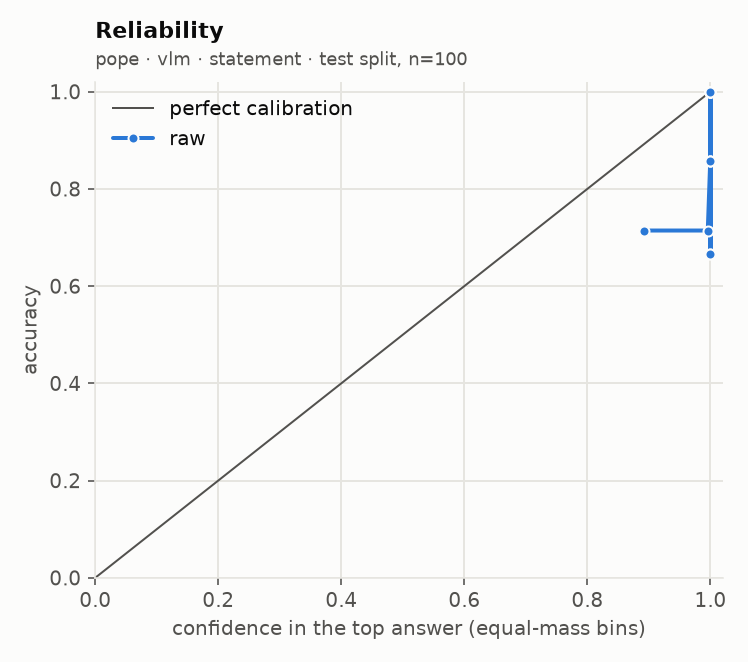
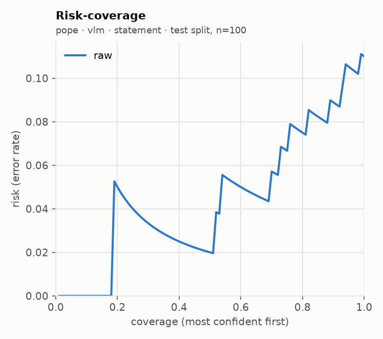

# glance eval report · run `20260919T225415Z-b07b50`

**Go/no-go: PARTIAL** (judged on held-out test splits; primary local backend: `vlm`)

| Metric | Threshold | Measured | Pass |
| --- | --- | --- | --- |
| Accuracy gap vs frontier baseline | <= 5 points, macro-averaged over suites | not measured (no frontier baseline run) | not measured |
| ECE after calibration | <= 0.05 per suite (15 equal-mass bins) | not measured (uncalibrated run) | not measured |
| Selective accuracy at 80% coverage | >= baseline full-coverage accuracy | 0.925 local (macro); baseline not measured | not measured |
| Permutation invariance (choice) | max probability shift <= 1e-3 (independent) | not measured | not measured |
| Latency, 1 image + 5 questions | recorded; target <= 2000 ms on mps (not a gate) | p50 8708 ms, p95 11029 ms | recorded |

## Run

- Machine: Apple M5, 32.0 GB RAM, device `mps`, tier `apple_32gb`
- `vlm`: `Qwen/Qwen3-VL-4B-Instruct@ebb281ec70b05090aa6165b016eac8ec08e71b17` (float16, image token budget 768)
- Harness 0.1.0 at git `3f116790f2`, prompts `p1`, prefix cache off
- n per suite: requested 200, used 200, seed 7, alternating calibration/test down the seeded order

## Per-suite results (test split)

| Suite | Backend | Method | n | Acc | AUROC / F1 / MAE | NLL raw→cal | Brier raw→cal | ECE raw→cal | Sel acc 50/80/90/100 (cal) | Failures | Valid |
| --- | --- | --- | --- | --- | --- | --- | --- | --- | --- | --- | --- |
| pope | vlm | statement | 100 | 0.890 | 0.931 | 1.788 → - | 0.108 → - | 0.102 → - | 0.980 / 0.925 / 0.911 / 0.890 | 0/200 | yes |

AUROC for noul, macro-F1 for choice, mean absolute error in levels (expected score vs label) for score. Selective accuracy ranks by `confidence` (noul: `2·|p − 0.5|`). A suite with more than 2% failed items is invalid.

## Calibration

This run is uncalibrated (no calibration params were fit).

## `independent` against `letter`

No choice suite ran with both methods.

## Local against the frontier baseline

The frontier baseline did not run, so the accuracy-gap and selective-accuracy rows read "not measured". Set `FRONTIER_MODEL` and its API key in `.env`, then run `glance eval --model frontier --confirm-spend` (or the full eval again with `--confirm-spend`).

## Latency and throughput

| Backend | Images | Questions | Statements | p50 ms | p95 ms | Requests |
| --- | --- | --- | --- | --- | --- | --- |
| vlm | 1 | 5 | 11 | 8708 | 11029 | 20 |

| Suite | Backend | Method | p50 ms / request | p95 ms / request | Statements / s | Mean image tokens | off_mass mean | off_mass p95 |
| --- | --- | --- | --- | --- | --- | --- | --- | --- |
| pope | vlm | statement | 454 | 537 | 2.1 | 277 | 0.00000 | 0.00000 |

## Plots

**pope · vlm · statement**

 

## Highest-confidence errors (up to 20 per suite)

### pope · vlm · statement

Most common confusions: yes → no (11)

| Item | True | Predicted | Confidence | Top probability | Image |
| --- | --- | --- | --- | --- | --- |
| popular_779 | yes | no | 1.000 | 1.000 | `.cache/eval_images/pope/popular_779.jpg` |
| random_2417 | yes | no | 1.000 | 1.000 | `.cache/eval_images/pope/random_2417.jpg` |
| popular_179 | yes | no | 1.000 | 1.000 | `.cache/eval_images/pope/popular_179.jpg` |
| random_2269 | yes | no | 1.000 | 1.000 | `.cache/eval_images/pope/random_2269.jpg` |
| adversarial_1113 | yes | no | 1.000 | 1.000 | `.cache/eval_images/pope/adversarial_1113.jpg` |
| popular_121 | yes | no | 1.000 | 1.000 | `.cache/eval_images/pope/popular_121.jpg` |
| adversarial_1887 | yes | no | 1.000 | 1.000 | `.cache/eval_images/pope/adversarial_1887.jpg` |
| adversarial_2707 | yes | no | 0.996 | 0.998 | `.cache/eval_images/pope/adversarial_2707.jpg` |
| popular_1297 | yes | no | 0.977 | 0.989 | `.cache/eval_images/pope/popular_1297.jpg` |
| random_1219 | yes | no | 0.972 | 0.986 | `.cache/eval_images/pope/random_1219.jpg` |
| adversarial_941 | yes | no | 0.696 | 0.848 | `.cache/eval_images/pope/adversarial_941.jpg` |

