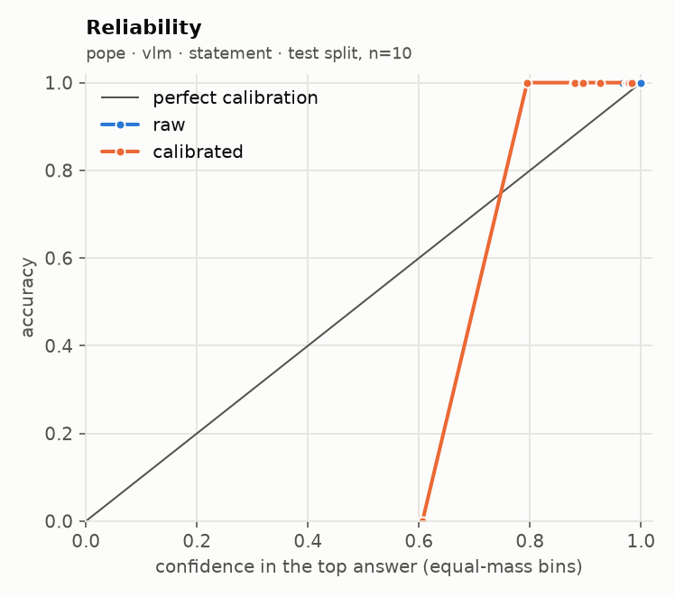
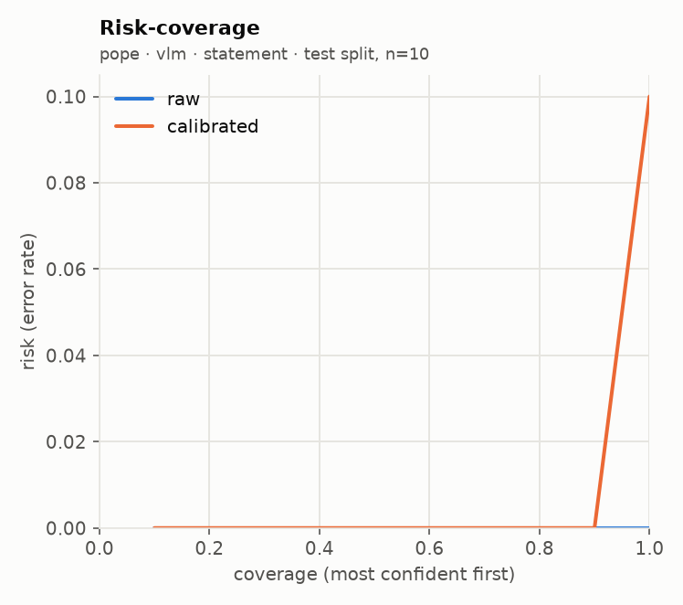

# glance eval report · run `20260920T043928Z-080b13`

**Go/no-go: NO-GO** (judged on held-out test splits; primary local backend: `vlm`)

| Metric | Threshold | Measured | Pass |
| --- | --- | --- | --- |
| Accuracy gap vs frontier baseline | <= 5 points, macro-averaged over suites | not measured (no frontier baseline run) | not measured |
| ECE after calibration | <= 0.05 per suite (15 equal-mass bins) | worst 0.132 (pope, sampling floor 0.167); over threshold: pope | FAIL |
| Selective accuracy at 80% coverage | >= baseline full-coverage accuracy | 1.000 local (macro); baseline not measured | not measured |
| Permutation invariance (choice) | max probability shift <= 1e-3 (independent) | not measured | not measured |
| Latency, 1 image + 5 questions | recorded; target <= 2000 ms on mps (not a gate) | p50 1265 ms, p95 1462 ms | recorded |

## Run

- Machine: Apple M5, 32.0 GB RAM, device `mps`, tier `apple_32gb`
- `vlm`: `Qwen/Qwen3-VL-4B-Instruct@ebb281ec70b05090aa6165b016eac8ec08e71b17` (float16, image token budget 768)
- Harness 0.2.0 at git `2ea52c58c2`, prompts `p1`, prefix cache on
- Prefix cache check: 3.75x on 100 items (1685 statements); argmax agreement 100/100, max |dz| 0.075 vs limit 0.05 -> acceptance NOT met, shipped uncached
- n per suite: requested 20; used pope 20; seed 7, calibration/test alternate down the seeded order

## Per-suite results (test split)

| Suite | Backend | Method | n | Acc | AUROC / F1 / MAE | NLL raw→cal | Brier raw→cal | ECE raw→cal | ECE floor at this n | Sel acc 50/80/90/100 (cal) | Failures | Valid |
| --- | --- | --- | --- | --- | --- | --- | --- | --- | --- | --- | --- | --- |
| pope | vlm | statement | 10 | 1.000 → 0.900 | 1.000 | 0.003 → 0.169 | 0.000 → 0.046 | 0.003 → 0.132 | 0.167 | 1.000 / 1.000 / 1.000 / 0.900 | 0/20 | yes |

AUROC for noul, macro-F1 for choice, mean absolute error in levels (expected score vs label) for score. Selective accuracy ranks by `confidence` (noul: `2·|p − 0.5|`). A suite with more than 2% failed items is invalid. `ECE floor at this n` is the ECE a perfectly calibrated predictor with the same confidences would measure on this many items (200 simulated draws): equal-mass ECE is biased upward on small samples, so read each ECE against its floor.

**Flagged: calibrated ECE is not below raw ECE on the test split for:** `pope` (vlm, statement: 0.003 → 0.132)

## Error breakdown (what v1 data this points to)

| Suite | Type | Test n | Error rate | ECE (best available) | Over ECE threshold | Gap to baseline (points) | Top confusions |
| --- | --- | --- | --- | --- | --- | --- | --- |
| pope | noul | 10 | 10.0% | 0.132 | yes | - | no → yes (1) |

Primary backend `vlm`, `independent` for choice. Recommended v1 data: by error rate: pope (noul) 10.0%; calibrated ECE still over 0.05: pope 0.132; gap to a frontier baseline not measured.

## Calibration

| Version | Backend | Choice method | Type | Fit | Params | n (cal split) | Suites pooled | NLL before→after | ECE before→after |
| --- | --- | --- | --- | --- | --- | --- | --- | --- | --- |
| cal_1d9418 | vlm | independent | noul | platt | {'a': 0.1324, 'b': 0.875} | 10 | pope | 1.882 → 0.381 | 0.237 → 0.248 |

Pooled fit (what the API applies) against a per-suite fit, on the test split:

| Suite | Backend | Method | ECE raw | ECE pooled fit | ECE per-suite fit | NLL pooled | NLL per-suite |
| --- | --- | --- | --- | --- | --- | --- | --- |
| pope | vlm | statement | 0.003 | 0.132 | 0.132 | 0.169 | 0.169 |

## `independent` against `letter`

No choice suite ran with both methods.

## Local against the frontier baseline

The frontier baseline did not run, so the accuracy-gap and selective-accuracy rows read "not measured". Set `FRONTIER_MODEL` and its API key in `.env`, then run `glance eval --model frontier --confirm-spend` (or the full eval again with `--confirm-spend`).

## Latency and throughput

| Backend | Images | Questions | Statements | p50 ms | p95 ms | Requests |
| --- | --- | --- | --- | --- | --- | --- |
| vlm | 1 | 5 | 11 | 1265 | 1462 | 20 |

| Suite | Backend | Method | p50 ms / request | p95 ms / request | Statements / s | Mean image tokens | off_mass mean | off_mass p95 |
| --- | --- | --- | --- | --- | --- | --- | --- | --- |
| pope | vlm | statement | 529 | 608 | 1.9 | 286 | 0.00453 | 0.01213 |

## Plots

**pope · vlm · statement**

 

## Highest-confidence errors (up to 20 per suite)

### pope · vlm · statement

Most common confusions: no → yes (1)

| Item | True | Predicted | Confidence | Top probability | Image |
| --- | --- | --- | --- | --- | --- |
| adversarial_1186 | no | yes | 0.212 | 0.606 | `.cache/eval_images/pope/adversarial_1186.jpg` |

