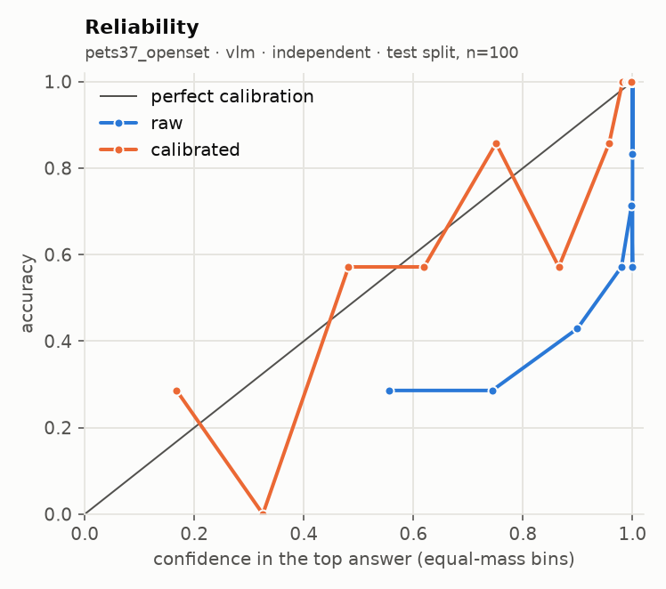
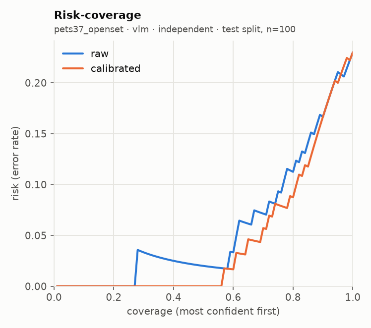

# glance eval report · run `20260920T054245Z-9b6a43`

**Go/no-go: NO-GO** (judged on held-out test splits; primary local backend: `vlm`)

| Metric | Threshold | Measured | Pass |
| --- | --- | --- | --- |
| Accuracy gap vs frontier baseline | <= 5 points, macro-averaged over suites | not measured (no frontier baseline run) | not measured |
| ECE after calibration | <= 0.05 per suite (15 equal-mass bins) | worst 0.079 (pets37_openset, sampling floor 0.065); over threshold: pets37_openset | FAIL |
| Selective accuracy at 80% coverage | >= baseline full-coverage accuracy | 0.912 local (macro); baseline not measured | not measured |
| Permutation invariance (choice) | max probability shift <= 1e-3 (independent) | not measured | not measured |
| Latency, 1 image + 5 questions | recorded; target <= 2000 ms (not a gate) | not measured | recorded |

## Run

- Machine: Apple M5, 32.0 GB RAM, device `mps`, tier `apple_32gb`
- `vlm`: `Qwen/Qwen3-VL-4B-Instruct@ebb281ec70b05090aa6165b016eac8ec08e71b17` (float16, image token budget 768)
- Harness 0.2.1 at git `d0bb23bd0c`, prompts `p1`, prefix cache off (reference path)
- Prefix cache check: 3.75x on 100 items (1685 statements); argmax agreement 100/100, max |dz| 0.075 vs limit 0.05 -> acceptance NOT met, shipped uncached
- n per suite: requested 200; used pets37_openset 200; seed 7, calibration/test alternate down the seeded order

## Per-suite results (test split)

| Suite | Backend | Method | n | Acc | AUROC / F1 / MAE | NLL raw→cal | Brier raw→cal | ECE raw→cal | ECE floor at this n | Sel acc 50/80/90/100 (cal) | Failures | Valid |
| --- | --- | --- | --- | --- | --- | --- | --- | --- | --- | --- | --- | --- |
| pets37_openset | vlm | independent | 100 | 0.770 | 0.795 | 1.464 → 0.673 | 0.364 → 0.291 | 0.172 → 0.079 | 0.065 | 1.000 / 0.912 / 0.833 / 0.770 | 0/200 | yes |

AUROC for noul, macro-F1 for choice, mean absolute error in levels (expected score vs label) for score. Selective accuracy ranks by `confidence` (noul: `2·|p − 0.5|`). A suite with more than 2% failed items is invalid. `ECE floor at this n` is the ECE a perfectly calibrated predictor with the same confidences would measure on this many items (200 simulated draws): equal-mass ECE is biased upward on small samples, so read each ECE against its floor.

## Error breakdown (what v1 data this points to)

| Suite | Type | Test n | Error rate | ECE (best available) | Over ECE threshold | Gap to baseline (points) | Top confusions |
| --- | --- | --- | --- | --- | --- | --- | --- |
| pets37_openset | choice | 100 | 23.0% | 0.079 | yes | - | other → bengal (6); american_bulldog → american_pit_bull_terrier (2); other → keeshond (2) |

Primary backend `vlm`, `independent` for choice. Recommended v1 data: by error rate: pets37_openset (choice) 23.0%; calibrated ECE still over 0.05: pets37_openset 0.079; gap to a frontier baseline not measured.

## Calibration

| Version | Backend | Choice method | Type | Fit | Params | n (cal split) | Suites pooled | NLL before→after | ECE before→after |
| --- | --- | --- | --- | --- | --- | --- | --- | --- | --- |
| cal_1d9418 | vlm | independent | choice | temperature | {'T': 3.6962} | 100 | pets37_openset | 1.609 → 0.702 | 0.182 → 0.076 |

Pooled fit (what the API applies) against a per-suite fit, on the test split:

| Suite | Backend | Method | ECE raw | ECE pooled fit | ECE per-suite fit | NLL pooled | NLL per-suite |
| --- | --- | --- | --- | --- | --- | --- | --- |
| pets37_openset | vlm | independent | 0.172 | 0.079 | 0.079 | 0.673 | 0.673 |

## `independent` against `letter`

No choice suite ran with both methods.

## Local against the frontier baseline

The frontier baseline did not run, so the accuracy-gap and selective-accuracy rows read "not measured". Set `FRONTIER_MODEL` and its API key in `.env`, then run `glance eval --model frontier --confirm-spend` (or the full eval again with `--confirm-spend`).

## Latency and throughput

| Suite | Backend | Method | p50 ms / request | p95 ms / request | Statements / s | Mean image tokens | off_mass mean | off_mass p95 |
| --- | --- | --- | --- | --- | --- | --- | --- | --- |
| pets37_openset | vlm | independent | 7639 | 9991 | 4.1 | 177 | 0.00000 | 0.00000 |

## Plots

**pets37_openset · vlm · independent**

 

## Highest-confidence errors (up to 20 per suite)

### pets37_openset · vlm · independent

Most common confusions: other → bengal (6); american_bulldog → american_pit_bull_terrier (2); other → keeshond (2)

| Item | True | Predicted | Confidence | Top probability | Image |
| --- | --- | --- | --- | --- | --- |
| Egyptian_Mau_83 | other | bengal | 0.902 | 0.949 | `.cache/eval_images/pets37/Egyptian_Mau_83.jpg` |
| Ragdoll_67 | ragdoll | birman | 0.828 | 0.864 | `.cache/eval_images/pets37/Ragdoll_67.jpg` |
| Egyptian_Mau_87 | other | bengal | 0.794 | 0.872 | `.cache/eval_images/pets37/Egyptian_Mau_87.jpg` |
| american_bulldog_98 | american_bulldog | american_pit_bull_terrier | 0.744 | 0.601 | `.cache/eval_images/pets37/american_bulldog_98.jpg` |
| Egyptian_Mau_7 | other | bengal | 0.737 | 0.829 | `.cache/eval_images/pets37/Egyptian_Mau_7.jpg` |
| Ragdoll_224 | ragdoll | birman | 0.703 | 0.511 | `.cache/eval_images/pets37/Ragdoll_224.jpg` |
| american_bulldog_216 | american_bulldog | american_pit_bull_terrier | 0.594 | 0.459 | `.cache/eval_images/pets37/american_bulldog_216.jpg` |
| Egyptian_Mau_27 | other | bengal | 0.581 | 0.697 | `.cache/eval_images/pets37/Egyptian_Mau_27.jpg` |
| saint_bernard_5 | other | great_pyrenees | 0.556 | 0.610 | `.cache/eval_images/pets37/saint_bernard_5.jpg` |
| Egyptian_Mau_214 | other | siamese | 0.522 | 0.591 | `.cache/eval_images/pets37/Egyptian_Mau_214.jpg` |
| Abyssinian_87 | other | bengal | 0.420 | 0.440 | `.cache/eval_images/pets37/Abyssinian_87.jpg` |
| yorkshire_terrier_191 | other | english_cocker_spaniel | 0.416 | 0.436 | `.cache/eval_images/pets37/yorkshire_terrier_191.jpg` |
| Abyssinian_4 | other | siamese | 0.355 | 0.299 | `.cache/eval_images/pets37/Abyssinian_4.jpg` |
| Egyptian_Mau_213 | other | bengal | 0.333 | 0.300 | `.cache/eval_images/pets37/Egyptian_Mau_213.jpg` |
| Maine_Coon_244 | maine_coon | other | 0.310 | 0.272 | `.cache/eval_images/pets37/Maine_Coon_244.jpg` |
| havanese_71 | other | japanese_chin | 0.309 | 0.379 | `.cache/eval_images/pets37/havanese_71.jpg` |
| havanese_19 | other | japanese_chin | 0.295 | 0.327 | `.cache/eval_images/pets37/havanese_19.jpg` |
| beagle_198 | beagle | basset_hound | 0.256 | 0.262 | `.cache/eval_images/pets37/beagle_198.jpg` |
| British_Shorthair_248 | other | ragdoll | 0.230 | 0.150 | `.cache/eval_images/pets37/British_Shorthair_248.jpg` |
| wheaten_terrier_80 | other | keeshond | 0.208 | 0.174 | `.cache/eval_images/pets37/wheaten_terrier_80.jpg` |

