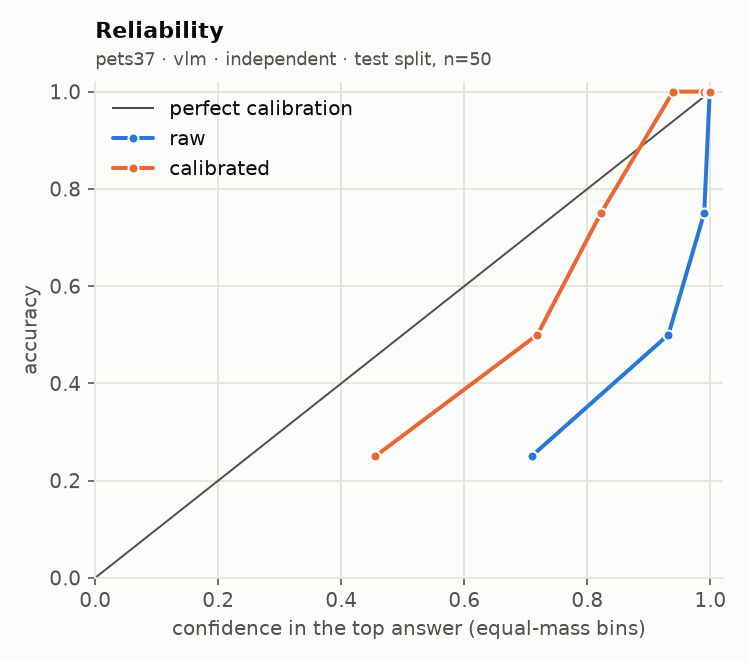
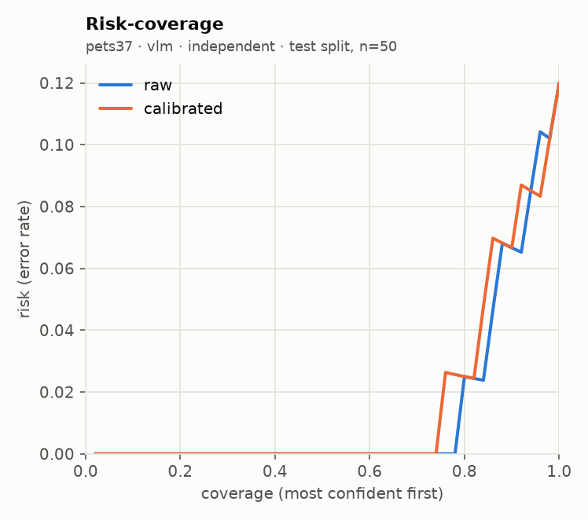

# glance eval report · run `20260920T050215Z-c69a81`

**Go/no-go: PARTIAL** (judged on held-out test splits; primary local backend: `vlm`)

| Metric | Threshold | Measured | Pass |
| --- | --- | --- | --- |
| Accuracy gap vs frontier baseline | <= 5 points, macro-averaged over suites | not measured (no frontier baseline run) | not measured |
| ECE after calibration | <= 0.05 per suite (15 equal-mass bins) | worst 0.046 (pets37, sampling floor 0.051); all suites under | pass |
| Selective accuracy at 80% coverage | >= baseline full-coverage accuracy | 0.975 local (macro); baseline not measured | not measured |
| Permutation invariance (choice) | max probability shift <= 1e-3 (independent) | not measured | not measured |
| Latency, 1 image + 5 questions | recorded; target <= 2000 ms (not a gate) | not measured | recorded |

## Run

- Machine: Apple M5, 32.0 GB RAM, device `mps`, tier `apple_32gb`
- `vlm`: `Qwen/Qwen3-VL-4B-Instruct@ebb281ec70b05090aa6165b016eac8ec08e71b17` (float16, image token budget 128)
- Harness 0.2.1 at git `d0bb23bd0c`, prompts `p1`, prefix cache off (reference path)
- Prefix cache check: 3.75x on 100 items (1685 statements); argmax agreement 100/100, max |dz| 0.075 vs limit 0.05 -> acceptance NOT met, shipped uncached
- n per suite: requested 100; used pets37 100; seed 7, calibration/test alternate down the seeded order

## Per-suite results (test split)

| Suite | Backend | Method | n | Acc | AUROC / F1 / MAE | NLL raw→cal | Brier raw→cal | ECE raw→cal | ECE floor at this n | Sel acc 50/80/90/100 (cal) | Failures | Valid |
| --- | --- | --- | --- | --- | --- | --- | --- | --- | --- | --- | --- | --- |
| pets37 | vlm | independent | 50 | 0.880 | 0.774 | 0.581 → 0.345 | 0.210 → 0.165 | 0.091 → 0.046 | 0.051 | 1.000 / 0.975 / 0.933 / 0.880 | 0/100 | yes |

AUROC for noul, macro-F1 for choice, mean absolute error in levels (expected score vs label) for score. Selective accuracy ranks by `confidence` (noul: `2·|p − 0.5|`). A suite with more than 2% failed items is invalid. `ECE floor at this n` is the ECE a perfectly calibrated predictor with the same confidences would measure on this many items (200 simulated draws): equal-mass ECE is biased upward on small samples, so read each ECE against its floor.

## Error breakdown (what v1 data this points to)

| Suite | Type | Test n | Error rate | ECE (best available) | Over ECE threshold | Gap to baseline (points) | Top confusions |
| --- | --- | --- | --- | --- | --- | --- | --- |
| pets37 | choice | 50 | 12.0% | 0.046 | no | - | american_bulldog → american_pit_bull_terrier (2); russian_blue → abyssinian (1); german_shorthaired → basset_hound (1) |

Primary backend `vlm`, `independent` for choice. Recommended v1 data: by error rate: pets37 (choice) 12.0%; gap to a frontier baseline not measured.

## Calibration

| Version | Backend | Choice method | Type | Fit | Params | n (cal split) | Suites pooled | NLL before→after | ECE before→after |
| --- | --- | --- | --- | --- | --- | --- | --- | --- | --- |
| cal_589d48 | vlm | independent | choice | temperature | {'T': 2.3617} | 50 | pets37 | 0.380 → 0.251 | 0.077 → 0.076 |

Pooled fit (what the API applies) against a per-suite fit, on the test split:

| Suite | Backend | Method | ECE raw | ECE pooled fit | ECE per-suite fit | NLL pooled | NLL per-suite |
| --- | --- | --- | --- | --- | --- | --- | --- |
| pets37 | vlm | independent | 0.091 | 0.046 | 0.046 | 0.345 | 0.345 |

## `independent` against `letter`

No choice suite ran with both methods.

## Local against the frontier baseline

The frontier baseline did not run, so the accuracy-gap and selective-accuracy rows read "not measured". Set `FRONTIER_MODEL` and its API key in `.env`, then run `glance eval --model frontier --confirm-spend` (or the full eval again with `--confirm-spend`).

## Latency and throughput

| Suite | Backend | Method | p50 ms / request | p95 ms / request | Statements / s | Mean image tokens | off_mass mean | off_mass p95 |
| --- | --- | --- | --- | --- | --- | --- | --- | --- |
| pets37 | vlm | independent | 6577 | 6709 | 5.7 | 114 | 0.00000 | 0.00000 |

## Plots

**pets37 · vlm · independent**

 

## Highest-confidence errors (up to 20 per suite)

### pets37 · vlm · independent

Most common confusions: american_bulldog → american_pit_bull_terrier (2); russian_blue → abyssinian (1); german_shorthaired → basset_hound (1)

| Item | True | Predicted | Confidence | Top probability | Image |
| --- | --- | --- | --- | --- | --- |
| american_bulldog_98 | american_bulldog | american_pit_bull_terrier | 0.883 | 0.867 | `.cache/eval_images/pets37/american_bulldog_98.jpg` |
| german_shorthaired_2 | german_shorthaired | basset_hound | 0.796 | 0.750 | `.cache/eval_images/pets37/german_shorthaired_2.jpg` |
| Ragdoll_67 | ragdoll | birman | 0.791 | 0.630 | `.cache/eval_images/pets37/Ragdoll_67.jpg` |
| american_bulldog_216 | american_bulldog | american_pit_bull_terrier | 0.778 | 0.705 | `.cache/eval_images/pets37/american_bulldog_216.jpg` |
| Russian_Blue_253 | russian_blue | abyssinian | 0.404 | 0.301 | `.cache/eval_images/pets37/Russian_Blue_253.jpg` |
| beagle_198 | beagle | basset_hound | 0.388 | 0.402 | `.cache/eval_images/pets37/beagle_198.jpg` |

