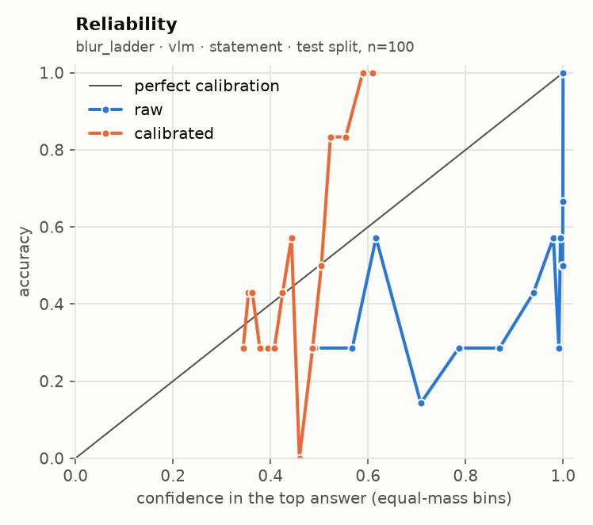
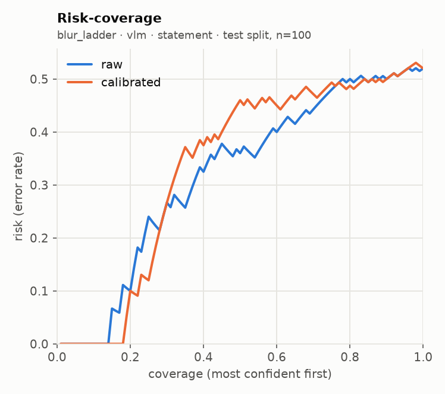
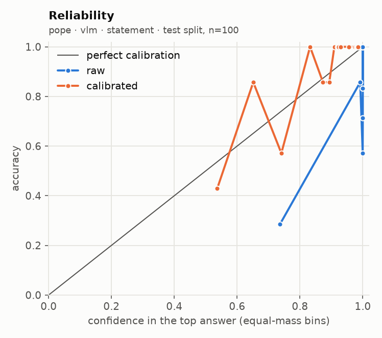
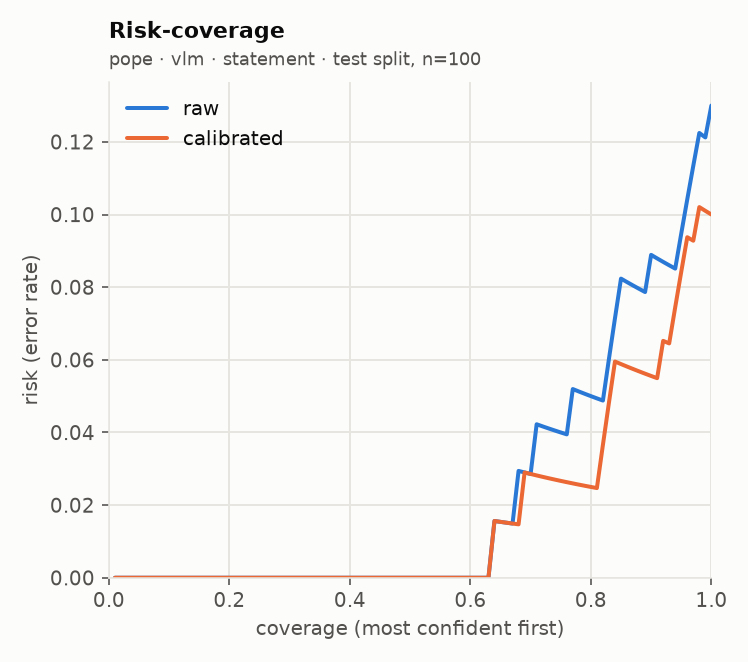

# glance eval report · run `20260920T044701Z-8d8d3c`

**Go/no-go: NO-GO** (judged on held-out test splits; primary local backend: `vlm`)

| Metric | Threshold | Measured | Pass |
| --- | --- | --- | --- |
| Accuracy gap vs frontier baseline | <= 5 points, macro-averaged over suites | not measured (no frontier baseline run) | not measured |
| ECE after calibration | <= 0.05 per suite (15 equal-mass bins) | worst 0.176 (blur_ladder, sampling floor 0.158); over threshold: blur_ladder, pope | FAIL |
| Selective accuracy at 80% coverage | >= baseline full-coverage accuracy | 0.744 local (macro); baseline not measured | not measured |
| Permutation invariance (choice) | max probability shift <= 1e-3 (independent) | not measured | not measured |
| Latency, 1 image + 5 questions | recorded; target <= 2000 ms on mps (not a gate) | p50 1920 ms, p95 1966 ms | recorded |

## Run

- Machine: Apple M5, 32.0 GB RAM, device `mps`, tier `apple_32gb`
- `vlm`: `Qwen/Qwen3-VL-4B-Instruct@ebb281ec70b05090aa6165b016eac8ec08e71b17` (float16, image token budget 128)
- Harness 0.2.1 at git `d0bb23bd0c`, prompts `p1`, prefix cache off (reference path)
- Prefix cache check: 3.75x on 100 items (1685 statements); argmax agreement 100/100, max |dz| 0.075 vs limit 0.05 -> acceptance NOT met, shipped uncached
- n per suite: requested 200; used pope 200, blur_ladder 200; seed 7, calibration/test alternate down the seeded order

## Per-suite results (test split)

| Suite | Backend | Method | n | Acc | AUROC / F1 / MAE | NLL raw→cal | Brier raw→cal | ECE raw→cal | ECE floor at this n | Sel acc 50/80/90/100 (cal) | Failures | Valid |
| --- | --- | --- | --- | --- | --- | --- | --- | --- | --- | --- | --- | --- |
| blur_ladder | vlm | statement | 100 | 0.480 | 0.616 | 2.777 → 1.067 | 0.796 → 0.596 | 0.376 → 0.176 | 0.158 | 0.540 / 0.512 / 0.500 / 0.480 | 0/200 | yes |
| pope | vlm | statement | 100 | 0.870 → 0.900 | 0.960 | 1.183 → 0.240 | 0.109 → 0.070 | 0.111 → 0.079 | 0.091 | 1.000 / 0.975 / 0.944 / 0.900 | 0/200 | yes |

AUROC for noul, macro-F1 for choice, mean absolute error in levels (expected score vs label) for score. Selective accuracy ranks by `confidence` (noul: `2·|p − 0.5|`). A suite with more than 2% failed items is invalid. `ECE floor at this n` is the ECE a perfectly calibrated predictor with the same confidences would measure on this many items (200 simulated draws): equal-mass ECE is biased upward on small samples, so read each ECE against its floor.

## Error breakdown (what v1 data this points to)

| Suite | Type | Test n | Error rate | ECE (best available) | Over ECE threshold | Gap to baseline (points) | Top confusions |
| --- | --- | --- | --- | --- | --- | --- | --- |
| blur_ladder | score | 100 | 52.0% | 0.176 | yes | - | 2 → 3 (21); 0 → 1 (17); 2 → 1 (6) |
| pope | noul | 100 | 10.0% | 0.079 | yes | - | yes → no (7); no → yes (3) |

Primary backend `vlm`, `independent` for choice. Recommended v1 data: by error rate: blur_ladder (score) 52.0%, pope (noul) 10.0%; calibrated ECE still over 0.05: blur_ladder 0.176, pope 0.079; gap to a frontier baseline not measured.

## Calibration

| Version | Backend | Choice method | Type | Fit | Params | n (cal split) | Suites pooled | NLL before→after | ECE before→after |
| --- | --- | --- | --- | --- | --- | --- | --- | --- | --- |
| cal_589d48 | vlm | independent | noul | platt | {'a': 0.1488, 'b': 0.8415} | 100 | pope | 1.328 → 0.291 | 0.118 → 0.071 |
| cal_589d48 | vlm | independent | score | temperature | {'T': 8.5933} | 100 | blur_ladder | 3.475 → 1.143 | 0.375 → 0.152 |

Pooled fit (what the API applies) against a per-suite fit, on the test split:

| Suite | Backend | Method | ECE raw | ECE pooled fit | ECE per-suite fit | NLL pooled | NLL per-suite |
| --- | --- | --- | --- | --- | --- | --- | --- |
| blur_ladder | vlm | statement | 0.376 | 0.176 | 0.176 | 1.067 | 1.067 |
| pope | vlm | statement | 0.111 | 0.079 | 0.079 | 0.240 | 0.240 |

## `independent` against `letter`

No choice suite ran with both methods.

## Local against the frontier baseline

The frontier baseline did not run, so the accuracy-gap and selective-accuracy rows read "not measured". Set `FRONTIER_MODEL` and its API key in `.env`, then run `glance eval --model frontier --confirm-spend` (or the full eval again with `--confirm-spend`).

## Latency and throughput

| Backend | Images | Questions | Statements | p50 ms | p95 ms | Requests |
| --- | --- | --- | --- | --- | --- | --- |
| vlm | 1 | 5 | 11 | 1920 | 1966 | 20 |

| Suite | Backend | Method | p50 ms / request | p95 ms / request | Statements / s | Mean image tokens | off_mass mean | off_mass p95 |
| --- | --- | --- | --- | --- | --- | --- | --- | --- |
| blur_ladder | vlm | statement | 688 | 781 | 5.7 | 101 | 0.00000 | 0.00000 |
| pope | vlm | statement | 257 | 264 | 3.9 | 117 | 0.00000 | 0.00000 |

## Plots

**blur_ladder · vlm · statement**

 

**pope · vlm · statement**

 

## Highest-confidence errors (up to 20 per suite)

### blur_ladder · vlm · statement

Most common confusions: 2 → 3 (21); 0 → 1 (17); 2 → 1 (6)

| Item | True | Predicted | Confidence | Top probability | Image |
| --- | --- | --- | --- | --- | --- |
| bass/image_0008_blur2 | 2 | 3 | 0.218 | 0.492 | `.cache/eval_images/blur_ladder/bass_image_0008_blur2.jpg` |
| cup/image_0025_blur2 | 2 | 3 | 0.216 | 0.503 | `.cache/eval_images/blur_ladder/cup_image_0025_blur2.jpg` |
| airplanes/image_0379_blur2 | 2 | 3 | 0.203 | 0.458 | `.cache/eval_images/blur_ladder/airplanes_image_0379_blur2.jpg` |
| dolphin/image_0026_blur2 | 2 | 3 | 0.201 | 0.448 | `.cache/eval_images/blur_ladder/dolphin_image_0026_blur2.jpg` |
| crayfish/image_0002_blur2 | 2 | 3 | 0.191 | 0.434 | `.cache/eval_images/blur_ladder/crayfish_image_0002_blur2.jpg` |
| metronome/image_0009_blur2 | 2 | 3 | 0.187 | 0.454 | `.cache/eval_images/blur_ladder/metronome_image_0009_blur2.jpg` |
| Faces/image_0167_blur2 | 2 | 3 | 0.187 | 0.422 | `.cache/eval_images/blur_ladder/Faces_image_0167_blur2.jpg` |
| Faces/image_0321_blur2 | 2 | 3 | 0.186 | 0.426 | `.cache/eval_images/blur_ladder/Faces_image_0321_blur2.jpg` |
| butterfly/image_0040_blur2 | 2 | 3 | 0.185 | 0.397 | `.cache/eval_images/blur_ladder/butterfly_image_0040_blur2.jpg` |
| rhino/image_0005_blur0 | 0 | 1 | 0.185 | 0.538 | `.cache/eval_images/blur_ladder/rhino_image_0005_blur0.jpg` |
| crocodile_head/image_0019_blur2 | 2 | 3 | 0.184 | 0.407 | `.cache/eval_images/blur_ladder/crocodile_head_image_0019_blur2.jpg` |
| Faces/image_0191_blur2 | 2 | 3 | 0.184 | 0.410 | `.cache/eval_images/blur_ladder/Faces_image_0191_blur2.jpg` |
| menorah/image_0028_blur2 | 2 | 3 | 0.181 | 0.403 | `.cache/eval_images/blur_ladder/menorah_image_0028_blur2.jpg` |
| airplanes/image_0467_blur1 | 1 | 3 | 0.173 | 0.395 | `.cache/eval_images/blur_ladder/airplanes_image_0467_blur1.jpg` |
| cougar_face/image_0012_blur2 | 2 | 3 | 0.169 | 0.384 | `.cache/eval_images/blur_ladder/cougar_face_image_0012_blur2.jpg` |
| Motorbikes/image_0209_blur2 | 2 | 3 | 0.166 | 0.387 | `.cache/eval_images/blur_ladder/Motorbikes_image_0209_blur2.jpg` |
| airplanes/image_0717_blur1 | 1 | 3 | 0.161 | 0.358 | `.cache/eval_images/blur_ladder/airplanes_image_0717_blur1.jpg` |
| Motorbikes/image_0045_blur2 | 2 | 3 | 0.159 | 0.358 | `.cache/eval_images/blur_ladder/Motorbikes_image_0045_blur2.jpg` |
| Faces/image_0239_blur1 | 1 | 2 | 0.159 | 0.374 | `.cache/eval_images/blur_ladder/Faces_image_0239_blur1.jpg` |
| chandelier/image_0042_blur2 | 2 | 3 | 0.158 | 0.397 | `.cache/eval_images/blur_ladder/chandelier_image_0042_blur2.jpg` |

### pope · vlm · statement

Most common confusions: yes → no (7); no → yes (3)

| Item | True | Predicted | Confidence | Top probability | Image |
| --- | --- | --- | --- | --- | --- |
| random_2269 | yes | no | 0.770 | 0.885 | `.cache/eval_images/pope/random_2269.jpg` |
| adversarial_1113 | yes | no | 0.750 | 0.875 | `.cache/eval_images/pope/adversarial_1113.jpg` |
| popular_121 | yes | no | 0.537 | 0.769 | `.cache/eval_images/pope/popular_121.jpg` |
| adversarial_2634 | no | yes | 0.451 | 0.725 | `.cache/eval_images/pope/adversarial_2634.jpg` |
| random_2417 | yes | no | 0.434 | 0.717 | `.cache/eval_images/pope/random_2417.jpg` |
| popular_179 | yes | no | 0.229 | 0.615 | `.cache/eval_images/pope/popular_179.jpg` |
| popular_779 | yes | no | 0.147 | 0.574 | `.cache/eval_images/pope/popular_779.jpg` |
| random_1219 | yes | no | 0.122 | 0.561 | `.cache/eval_images/pope/random_1219.jpg` |
| random_2446 | no | yes | 0.093 | 0.546 | `.cache/eval_images/pope/random_2446.jpg` |
| random_92 | no | yes | 0.044 | 0.522 | `.cache/eval_images/pope/random_92.jpg` |

