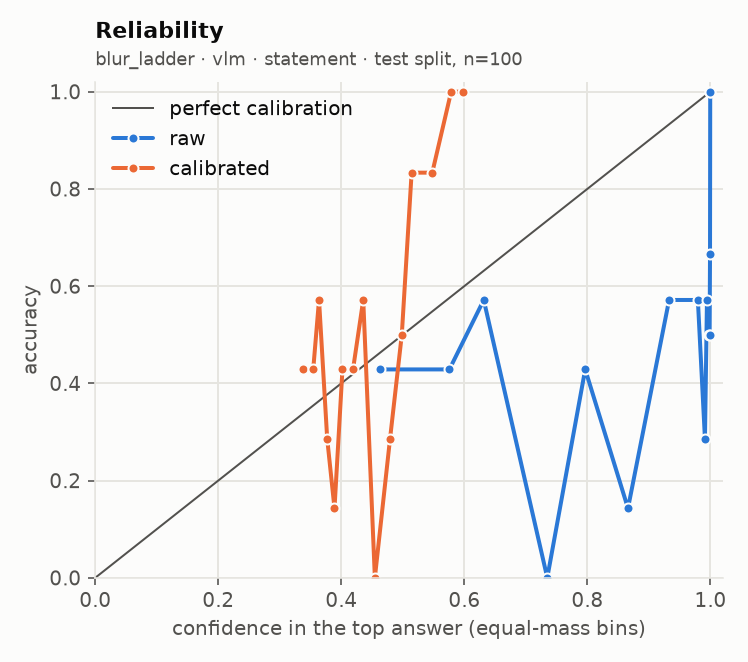
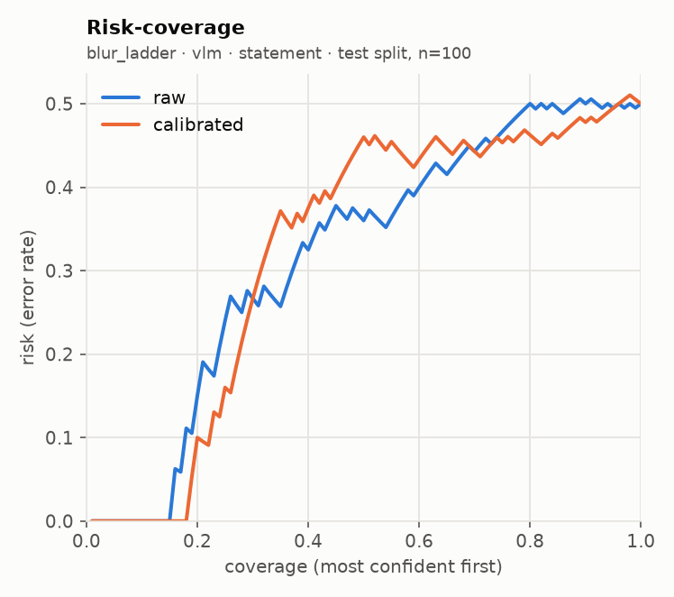
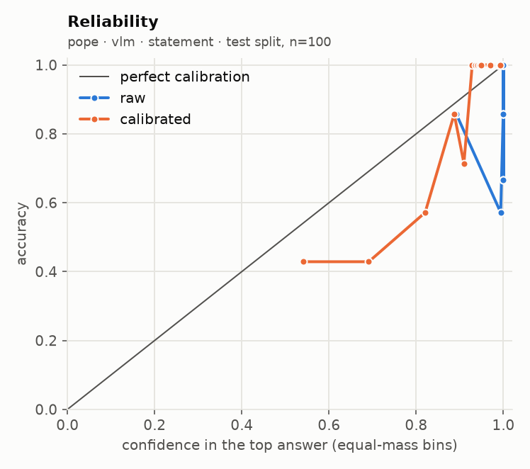
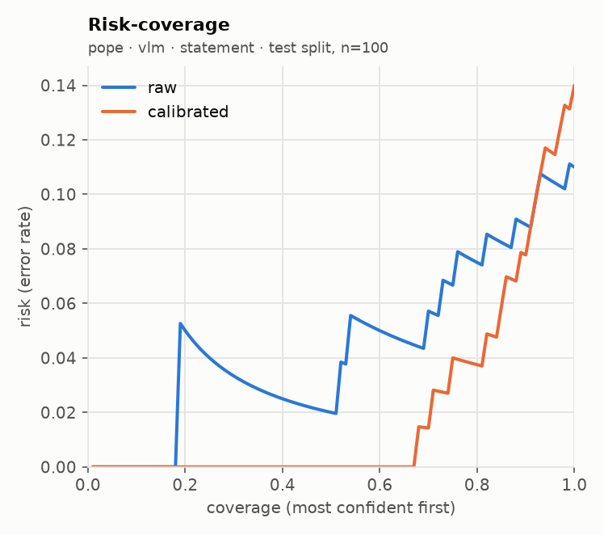

# glance eval report · run `20260920T045619Z-74b02b`

**Go/no-go: NO-GO** (judged on held-out test splits; primary local backend: `vlm`)

| Metric | Threshold | Measured | Pass |
| --- | --- | --- | --- |
| Accuracy gap vs frontier baseline | <= 5 points, macro-averaged over suites | not measured (no frontier baseline run) | not measured |
| ECE after calibration | <= 0.05 per suite (15 equal-mass bins) | worst 0.193 (blur_ladder, sampling floor 0.155); over threshold: blur_ladder, pope | FAIL |
| Selective accuracy at 80% coverage | >= baseline full-coverage accuracy | 0.750 local (macro); baseline not measured | not measured |
| Permutation invariance (choice) | max probability shift <= 1e-3 (independent) | not measured | not measured |
| Latency, 1 image + 5 questions | recorded; target <= 2000 ms on mps (not a gate) | p50 5390 ms, p95 5518 ms | recorded |

## Run

- Machine: Apple M5, 32.0 GB RAM, device `mps`, tier `apple_32gb`
- `vlm`: `Qwen/Qwen3-VL-4B-Instruct@ebb281ec70b05090aa6165b016eac8ec08e71b17` (float16, image token budget 384)
- Harness 0.2.1 at git `d0bb23bd0c`, prompts `p1`, prefix cache off (reference path)
- Prefix cache check: 3.75x on 100 items (1685 statements); argmax agreement 100/100, max |dz| 0.075 vs limit 0.05 -> acceptance NOT met, shipped uncached
- n per suite: requested 200; used pope 200, blur_ladder 200; seed 7, calibration/test alternate down the seeded order

## Per-suite results (test split)

| Suite | Backend | Method | n | Acc | AUROC / F1 / MAE | NLL raw→cal | Brier raw→cal | ECE raw→cal | ECE floor at this n | Sel acc 50/80/90/100 (cal) | Failures | Valid |
| --- | --- | --- | --- | --- | --- | --- | --- | --- | --- | --- | --- | --- |
| blur_ladder | vlm | statement | 100 | 0.500 | 0.620 | 2.770 → 1.069 | 0.791 → 0.597 | 0.357 → 0.193 | 0.155 | 0.540 / 0.537 / 0.522 / 0.500 | 0/200 | yes |
| pope | vlm | statement | 100 | 0.890 → 0.860 | 0.930 | 1.788 → 0.266 | 0.108 → 0.085 | 0.102 → 0.084 | 0.075 | 1.000 / 0.963 / 0.922 / 0.860 | 0/200 | yes |

AUROC for noul, macro-F1 for choice, mean absolute error in levels (expected score vs label) for score. Selective accuracy ranks by `confidence` (noul: `2·|p − 0.5|`). A suite with more than 2% failed items is invalid. `ECE floor at this n` is the ECE a perfectly calibrated predictor with the same confidences would measure on this many items (200 simulated draws): equal-mass ECE is biased upward on small samples, so read each ECE against its floor.

## Error breakdown (what v1 data this points to)

| Suite | Type | Test n | Error rate | ECE (best available) | Over ECE threshold | Gap to baseline (points) | Top confusions |
| --- | --- | --- | --- | --- | --- | --- | --- |
| blur_ladder | score | 100 | 50.0% | 0.193 | yes | - | 2 → 3 (21); 0 → 1 (17); 1 → 2 (4) |
| pope | noul | 100 | 14.0% | 0.084 | yes | - | yes → no (8); no → yes (6) |

Primary backend `vlm`, `independent` for choice. Recommended v1 data: by error rate: blur_ladder (score) 50.0%, pope (noul) 14.0%; calibrated ECE still over 0.05: blur_ladder 0.193, pope 0.084; gap to a frontier baseline not measured.

## Calibration

| Version | Backend | Choice method | Type | Fit | Params | n (cal split) | Suites pooled | NLL before→after | ECE before→after |
| --- | --- | --- | --- | --- | --- | --- | --- | --- | --- |
| cal_830f74 | vlm | independent | noul | platt | {'a': 0.1716, 'b': 1.059} | 100 | pope | 1.035 → 0.247 | 0.098 → 0.061 |
| cal_830f74 | vlm | independent | score | temperature | {'T': 8.9072} | 100 | blur_ladder | 3.573 → 1.152 | 0.358 → 0.210 |

Pooled fit (what the API applies) against a per-suite fit, on the test split:

| Suite | Backend | Method | ECE raw | ECE pooled fit | ECE per-suite fit | NLL pooled | NLL per-suite |
| --- | --- | --- | --- | --- | --- | --- | --- |
| blur_ladder | vlm | statement | 0.357 | 0.193 | 0.193 | 1.069 | 1.069 |
| pope | vlm | statement | 0.102 | 0.084 | 0.084 | 0.266 | 0.266 |

## `independent` against `letter`

No choice suite ran with both methods.

## Local against the frontier baseline

The frontier baseline did not run, so the accuracy-gap and selective-accuracy rows read "not measured". Set `FRONTIER_MODEL` and its API key in `.env`, then run `glance eval --model frontier --confirm-spend` (or the full eval again with `--confirm-spend`).

## Latency and throughput

| Backend | Images | Questions | Statements | p50 ms | p95 ms | Requests |
| --- | --- | --- | --- | --- | --- | --- |
| vlm | 1 | 5 | 11 | 5390 | 5518 | 20 |

| Suite | Backend | Method | p50 ms / request | p95 ms / request | Statements / s | Mean image tokens | off_mass mean | off_mass p95 |
| --- | --- | --- | --- | --- | --- | --- | --- | --- |
| blur_ladder | vlm | statement | 679 | 900 | 5.5 | 105 | 0.00000 | 0.00000 |
| pope | vlm | statement | 453 | 519 | 2.3 | 276 | 0.00000 | 0.00000 |

## Plots

**blur_ladder · vlm · statement**

 

**pope · vlm · statement**

 

## Highest-confidence errors (up to 20 per suite)

### blur_ladder · vlm · statement

Most common confusions: 2 → 3 (21); 0 → 1 (17); 1 → 2 (4)

| Item | True | Predicted | Confidence | Top probability | Image |
| --- | --- | --- | --- | --- | --- |
| bass/image_0008_blur2 | 2 | 3 | 0.210 | 0.486 | `.cache/eval_images/blur_ladder/bass_image_0008_blur2.jpg` |
| cup/image_0025_blur2 | 2 | 3 | 0.209 | 0.496 | `.cache/eval_images/blur_ladder/cup_image_0025_blur2.jpg` |
| airplanes/image_0379_blur2 | 2 | 3 | 0.196 | 0.452 | `.cache/eval_images/blur_ladder/airplanes_image_0379_blur2.jpg` |
| dolphin/image_0026_blur2 | 2 | 3 | 0.195 | 0.443 | `.cache/eval_images/blur_ladder/dolphin_image_0026_blur2.jpg` |
| crayfish/image_0002_blur2 | 2 | 3 | 0.185 | 0.430 | `.cache/eval_images/blur_ladder/crayfish_image_0002_blur2.jpg` |
| Faces/image_0167_blur2 | 2 | 3 | 0.181 | 0.418 | `.cache/eval_images/blur_ladder/Faces_image_0167_blur2.jpg` |
| metronome/image_0009_blur2 | 2 | 3 | 0.181 | 0.448 | `.cache/eval_images/blur_ladder/metronome_image_0009_blur2.jpg` |
| Faces/image_0321_blur2 | 2 | 3 | 0.180 | 0.422 | `.cache/eval_images/blur_ladder/Faces_image_0321_blur2.jpg` |
| butterfly/image_0040_blur2 | 2 | 3 | 0.180 | 0.394 | `.cache/eval_images/blur_ladder/butterfly_image_0040_blur2.jpg` |
| crocodile_head/image_0019_blur2 | 2 | 3 | 0.179 | 0.404 | `.cache/eval_images/blur_ladder/crocodile_head_image_0019_blur2.jpg` |
| Faces/image_0191_blur2 | 2 | 3 | 0.179 | 0.407 | `.cache/eval_images/blur_ladder/Faces_image_0191_blur2.jpg` |
| menorah/image_0028_blur2 | 2 | 3 | 0.176 | 0.400 | `.cache/eval_images/blur_ladder/menorah_image_0028_blur2.jpg` |
| rhino/image_0005_blur0 | 0 | 1 | 0.174 | 0.528 | `.cache/eval_images/blur_ladder/rhino_image_0005_blur0.jpg` |
| airplanes/image_0467_blur1 | 1 | 3 | 0.168 | 0.392 | `.cache/eval_images/blur_ladder/airplanes_image_0467_blur1.jpg` |
| cougar_face/image_0012_blur2 | 2 | 3 | 0.164 | 0.381 | `.cache/eval_images/blur_ladder/cougar_face_image_0012_blur2.jpg` |
| Motorbikes/image_0209_blur2 | 2 | 3 | 0.162 | 0.384 | `.cache/eval_images/blur_ladder/Motorbikes_image_0209_blur2.jpg` |
| airplanes/image_0717_blur1 | 1 | 3 | 0.157 | 0.356 | `.cache/eval_images/blur_ladder/airplanes_image_0717_blur1.jpg` |
| Motorbikes/image_0045_blur2 | 2 | 3 | 0.155 | 0.357 | `.cache/eval_images/blur_ladder/Motorbikes_image_0045_blur2.jpg` |
| Faces/image_0239_blur1 | 1 | 2 | 0.155 | 0.371 | `.cache/eval_images/blur_ladder/Faces_image_0239_blur1.jpg` |
| chandelier/image_0042_blur2 | 2 | 3 | 0.154 | 0.393 | `.cache/eval_images/blur_ladder/chandelier_image_0042_blur2.jpg` |

### pope · vlm · statement

Most common confusions: yes → no (8); no → yes (6)

| Item | True | Predicted | Confidence | Top probability | Image |
| --- | --- | --- | --- | --- | --- |
| adversarial_1113 | yes | no | 0.823 | 0.911 | `.cache/eval_images/pope/adversarial_1113.jpg` |
| random_2269 | yes | no | 0.812 | 0.906 | `.cache/eval_images/pope/random_2269.jpg` |
| popular_179 | yes | no | 0.803 | 0.901 | `.cache/eval_images/pope/popular_179.jpg` |
| popular_779 | yes | no | 0.642 | 0.821 | `.cache/eval_images/pope/popular_779.jpg` |
| random_2417 | yes | no | 0.626 | 0.813 | `.cache/eval_images/pope/random_2417.jpg` |
| popular_121 | yes | no | 0.600 | 0.800 | `.cache/eval_images/pope/popular_121.jpg` |
| adversarial_2634 | no | yes | 0.394 | 0.697 | `.cache/eval_images/pope/adversarial_2634.jpg` |
| random_2446 | no | yes | 0.346 | 0.673 | `.cache/eval_images/pope/random_2446.jpg` |
| adversarial_1887 | yes | no | 0.253 | 0.627 | `.cache/eval_images/pope/adversarial_1887.jpg` |
| adversarial_1186 | no | yes | 0.238 | 0.619 | `.cache/eval_images/pope/adversarial_1186.jpg` |
| popular_300 | no | yes | 0.165 | 0.583 | `.cache/eval_images/pope/popular_300.jpg` |
| adversarial_2506 | no | yes | 0.039 | 0.520 | `.cache/eval_images/pope/adversarial_2506.jpg` |
| random_1292 | no | yes | 0.023 | 0.511 | `.cache/eval_images/pope/random_1292.jpg` |
| adversarial_2707 | yes | no | 0.011 | 0.505 | `.cache/eval_images/pope/adversarial_2707.jpg` |

